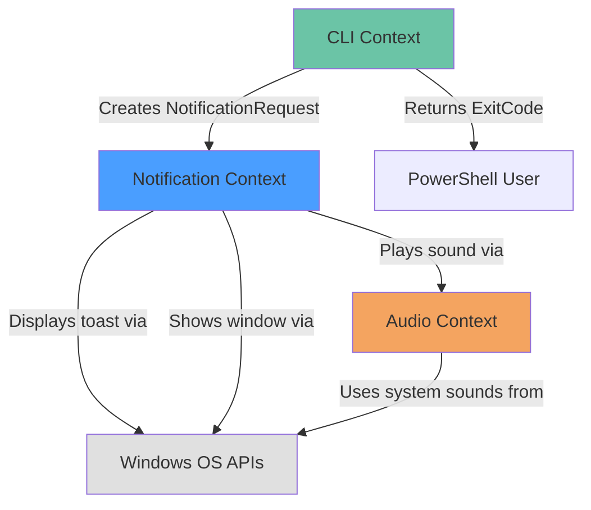
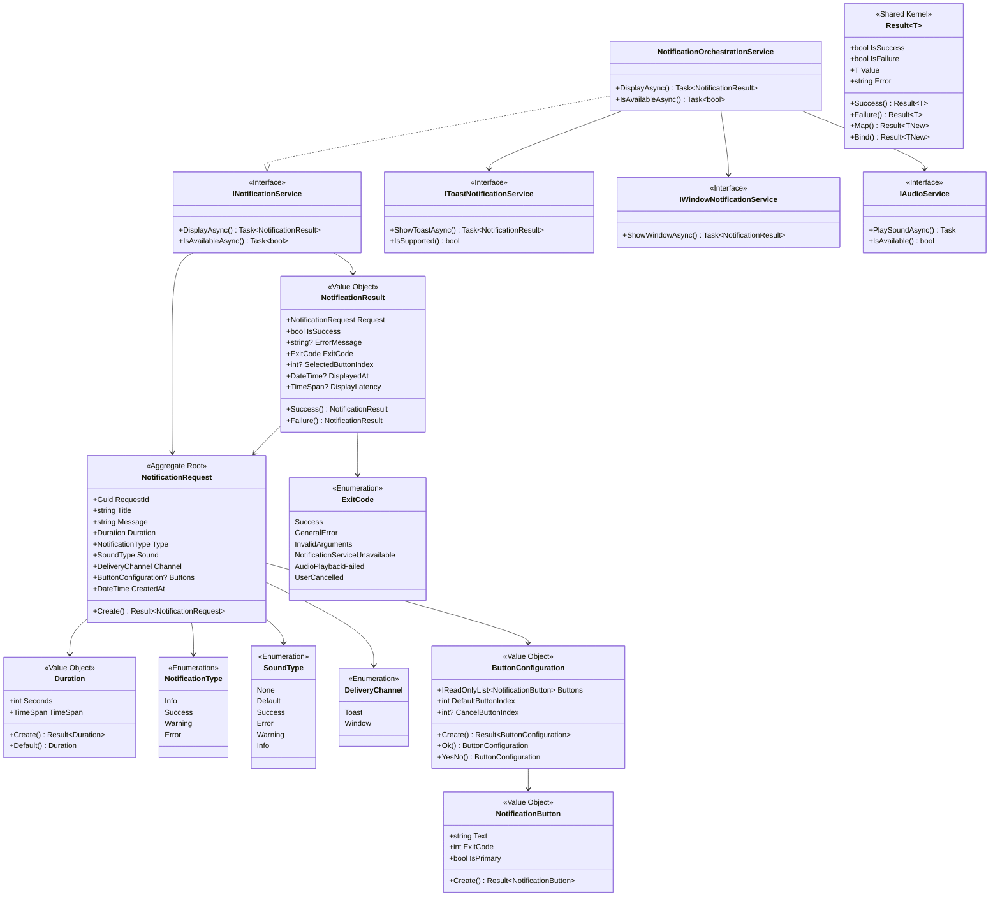

# Domain Model: Windows Notification System

**Session ID**: 20251122-001
**Phase**: Construction - Domain Design
**Created**: 2025-11-22
**Intent Reference**: intent-20251122-001.md
**Units Reference**: units-20251122-001.md

---

## Executive Summary

This domain model translates the Windows Notification System requirements into a Domain-Driven Design architecture using C# 13 and .NET 10. The model identifies three bounded contexts (Notification, CLI, Audio), defines aggregates with clear boundaries, and establishes a ubiquitous language shared between business and technical stakeholders.

**Key Design Principles**:
- Immutability using C# 13 records
- Required properties for compile-time safety
- Primary constructors for concise syntax
- Domain events for state change tracking
- Aggregate roots controlling access to child entities

---

## Bounded Contexts

### 1. Notification Context (Core Domain)

**Purpose**: Manages the lifecycle and delivery of notifications to Windows users

**Responsibilities**:
- Create and validate notification requests
- Dispatch notifications to appropriate channels (toast, window)
- Track notification results and errors
- Enforce business rules (duration limits, required fields)

**Boundaries**:
- **Inside**: NotificationRequest, NotificationResult, ToastNotification, WindowNotification, validation rules
- **Outside**: Audio playback, CLI parsing, Windows OS APIs

**Ubiquitous Language**:

| Term | Definition | Example |
|------|------------|---------|
| Notification | A visual message displayed to the user | "Build Complete" toast notification |
| Toast | Native Windows notification in Action Center | Auto-dismissing message in bottom-right |
| Window | Custom WPF window requiring acknowledgment | Modal dialog with Yes/No buttons |
| Duration | Time in seconds notification remains visible | 5 seconds (default), 1-30 range |
| Dismissal | Notification removed from display | Auto-dismiss after duration expires |
| Action Center | Windows built-in notification history | Shows past toasts |
| Notification Type | Category determining sound/icon | Success, Error, Warning, Info |
| Exit Code | Process return value for script integration | 0 = success, 1 = error |

### 2. CLI Context (Interface Layer)

**Purpose**: Provides command-line interface for PowerShell and script integration

**Responsibilities**:
- Parse command-line arguments
- Validate user input
- Return appropriate exit codes
- Display help documentation

**Boundaries**:
- **Inside**: Argument parsing, validation, help text, exit code mapping
- **Outside**: Notification creation logic, notification delivery

**Ubiquitous Language**:

| Term | Definition | Example |
|------|------------|---------|
| Argument | Command-line parameter | --title "Build Complete" |
| Exit Code | Process return value | 0 = success, 2 = invalid args |
| Help Text | Usage documentation | --help output |
| Validation | Input correctness checking | Title length < 255 chars |

### 3. Audio Context (Supporting Domain)

**Purpose**: Provides audible feedback for notifications

**Responsibilities**:
- Map notification types to system sounds
- Play Windows built-in sounds
- Handle audio device unavailability

**Boundaries**:
- **Inside**: Sound type mapping, audio playback
- **Outside**: Notification display logic

**Ubiquitous Language**:

| Term | Definition | Example |
|------|------------|---------|
| Sound Type | Audio category for notification | Success sound (Windows chime) |
| System Sound | Built-in Windows audio | SystemSounds.Exclamation |
| Silent Mode | No audio playback | --sound none |
| Audio Device | Output hardware for sound | Speakers, headphones |

---

## Aggregates

### Notification Aggregate

**Aggregate Root**: NotificationRequest

**Purpose**: Encapsulate notification creation, validation, and delivery coordination

#### Entities

##### NotificationRequest (Aggregate Root)

**Identity**: RequestId (Guid)

**Immutable Properties** (C# 13 Record):

```csharp
namespace WindowsNotificationSystem.Domain.Notifications;

/// <summary>
/// Aggregate root representing a user's request to display a notification.
/// Immutable after creation to ensure consistency.
/// </summary>
public sealed record NotificationRequest
{
    /// <summary>
    /// Unique identifier for this notification request.
    /// </summary>
    public required Guid RequestId { get; init; }

    /// <summary>
    /// Notification title (header text).
    /// </summary>
    public required string Title { get; init; }

    /// <summary>
    /// Notification message (body text).
    /// </summary>
    public required string Message { get; init; }

    /// <summary>
    /// How long the notification should display.
    /// </summary>
    public required Duration Duration { get; init; }

    /// <summary>
    /// Type of notification (affects sound and icon).
    /// </summary>
    public required NotificationType Type { get; init; }

    /// <summary>
    /// Sound to play when notification displays.
    /// </summary>
    public required SoundType Sound { get; init; }

    /// <summary>
    /// Delivery channel (toast or custom window).
    /// </summary>
    public required DeliveryChannel Channel { get; init; }

    /// <summary>
    /// Optional button configuration for window notifications.
    /// </summary>
    public ButtonConfiguration? Buttons { get; init; }

    /// <summary>
    /// Timestamp when request was created.
    /// </summary>
    public required DateTime CreatedAt { get; init; }

    /// <summary>
    /// Creates a new notification request with validation.
    /// </summary>
    public static Result<NotificationRequest> Create(
        string title,
        string message,
        int durationSeconds = 5,
        NotificationType type = NotificationType.Info,
        SoundType sound = SoundType.Default,
        DeliveryChannel channel = DeliveryChannel.Toast,
        ButtonConfiguration? buttons = null)
    {
        // Validation rules
        var errors = new List<string>();

        if (string.IsNullOrWhiteSpace(title))
            errors.Add("Title is required");
        else if (title.Length > 255)
            errors.Add("Title must be 255 characters or less");

        if (string.IsNullOrWhiteSpace(message))
            errors.Add("Message is required");
        else if (message.Length > 1000)
            errors.Add("Message must be 1000 characters or less");

        var durationResult = Duration.Create(durationSeconds);
        if (durationResult.IsFailure)
            errors.Add(durationResult.Error);

        if (channel == DeliveryChannel.Window && buttons == null)
            errors.Add("Window notifications require button configuration");

        if (errors.Any())
            return Result<NotificationRequest>.Failure(string.Join("; ", errors));

        return Result<NotificationRequest>.Success(new NotificationRequest
        {
            RequestId = Guid.NewGuid(),
            Title = title.Trim(),
            Message = message.Trim(),
            Duration = durationResult.Value,
            Type = type,
            Sound = sound,
            Channel = channel,
            Buttons = buttons,
            CreatedAt = DateTime.UtcNow
        });
    }
}
```

##### NotificationResult (Value Object)

**Purpose**: Capture the outcome of a notification delivery attempt

```csharp
namespace WindowsNotificationSystem.Domain.Notifications;

/// <summary>
/// Represents the result of attempting to display a notification.
/// Immutable value object.
/// </summary>
public sealed record NotificationResult
{
    /// <summary>
    /// The request that was processed.
    /// </summary>
    public required NotificationRequest Request { get; init; }

    /// <summary>
    /// Whether the notification was successfully displayed.
    /// </summary>
    public required bool IsSuccess { get; init; }

    /// <summary>
    /// Error message if delivery failed.
    /// </summary>
    public string? ErrorMessage { get; init; }

    /// <summary>
    /// Exit code to return to calling process.
    /// </summary>
    public required ExitCode ExitCode { get; init; }

    /// <summary>
    /// User's button selection (for window notifications).
    /// </summary>
    public int? SelectedButtonIndex { get; init; }

    /// <summary>
    /// When the notification was displayed.
    /// </summary>
    public DateTime? DisplayedAt { get; init; }

    /// <summary>
    /// How long the notification took to display.
    /// </summary>
    public TimeSpan? DisplayLatency { get; init; }

    /// <summary>
    /// Creates a successful result.
    /// </summary>
    public static NotificationResult Success(
        NotificationRequest request,
        DateTime displayedAt,
        TimeSpan latency,
        int? selectedButtonIndex = null)
    {
        return new NotificationResult
        {
            Request = request,
            IsSuccess = true,
            ExitCode = ExitCode.Success,
            DisplayedAt = displayedAt,
            DisplayLatency = latency,
            SelectedButtonIndex = selectedButtonIndex
        };
    }

    /// <summary>
    /// Creates a failure result.
    /// </summary>
    public static NotificationResult Failure(
        NotificationRequest request,
        string errorMessage,
        ExitCode exitCode = ExitCode.GeneralError)
    {
        return new NotificationResult
        {
            Request = request,
            IsSuccess = false,
            ErrorMessage = errorMessage,
            ExitCode = exitCode
        };
    }
}
```

#### Value Objects

##### Duration (Value Object)

**Purpose**: Encapsulate notification display duration with validation

```csharp
namespace WindowsNotificationSystem.Domain.ValueObjects;

/// <summary>
/// Represents how long a notification should display.
/// Immutable value object with built-in validation.
/// </summary>
public sealed record Duration
{
    public const int MinSeconds = 1;
    public const int MaxSeconds = 30;
    public const int DefaultSeconds = 5;

    /// <summary>
    /// Duration in seconds.
    /// </summary>
    public required int Seconds { get; init; }

    /// <summary>
    /// Duration as TimeSpan for .NET APIs.
    /// </summary>
    public TimeSpan TimeSpan => TimeSpan.FromSeconds(Seconds);

    /// <summary>
    /// Creates a validated duration.
    /// </summary>
    public static Result<Duration> Create(int seconds)
    {
        if (seconds < MinSeconds || seconds > MaxSeconds)
            return Result<Duration>.Failure(
                $"Duration must be between {MinSeconds} and {MaxSeconds} seconds");

        return Result<Duration>.Success(new Duration { Seconds = seconds });
    }

    /// <summary>
    /// Default duration (5 seconds).
    /// </summary>
    public static Duration Default => new() { Seconds = DefaultSeconds };

    /// <summary>
    /// String representation for logging.
    /// </summary>
    public override string ToString() => $"{Seconds}s";
}
```

##### NotificationType (Enum)

**Purpose**: Categorize notifications for appropriate sound/icon selection

```csharp
namespace WindowsNotificationSystem.Domain.ValueObjects;

/// <summary>
/// Categories of notifications affecting sound and visual presentation.
/// </summary>
public enum NotificationType
{
    /// <summary>
    /// General informational message.
    /// </summary>
    Info = 0,

    /// <summary>
    /// Successful operation completion.
    /// </summary>
    Success = 1,

    /// <summary>
    /// Warning about potential issue.
    /// </summary>
    Warning = 2,

    /// <summary>
    /// Error or failure condition.
    /// </summary>
    Error = 3
}
```

##### SoundType (Enum)

**Purpose**: Define audio feedback options

```csharp
namespace WindowsNotificationSystem.Domain.ValueObjects;

/// <summary>
/// Types of sounds that can play with notifications.
/// </summary>
public enum SoundType
{
    /// <summary>
    /// No sound (silent notification).
    /// </summary>
    None = 0,

    /// <summary>
    /// Default system notification sound.
    /// </summary>
    Default = 1,

    /// <summary>
    /// Success/completion sound (SystemSounds.Asterisk).
    /// </summary>
    Success = 2,

    /// <summary>
    /// Error/failure sound (SystemSounds.Hand).
    /// </summary>
    Error = 3,

    /// <summary>
    /// Warning sound (SystemSounds.Exclamation).
    /// </summary>
    Warning = 4,

    /// <summary>
    /// Information sound (SystemSounds.Beep).
    /// </summary>
    Info = 5
}
```

##### ExitCode (Enum)

**Purpose**: Standardize process exit codes for PowerShell integration

```csharp
namespace WindowsNotificationSystem.Domain.ValueObjects;

/// <summary>
/// Standard exit codes for the application.
/// Used by PowerShell scripts to detect success/failure.
/// </summary>
public enum ExitCode
{
    /// <summary>
    /// Notification displayed successfully.
    /// </summary>
    Success = 0,

    /// <summary>
    /// General error occurred.
    /// </summary>
    GeneralError = 1,

    /// <summary>
    /// Invalid command-line arguments.
    /// </summary>
    InvalidArguments = 2,

    /// <summary>
    /// Windows notification service unavailable.
    /// </summary>
    NotificationServiceUnavailable = 3,

    /// <summary>
    /// Audio playback failed.
    /// </summary>
    AudioPlaybackFailed = 4,

    /// <summary>
    /// User cancelled window notification.
    /// </summary>
    UserCancelled = 5
}
```

##### DeliveryChannel (Enum)

**Purpose**: Specify how notification should be presented

```csharp
namespace WindowsNotificationSystem.Domain.ValueObjects;

/// <summary>
/// Channels for delivering notifications to users.
/// </summary>
public enum DeliveryChannel
{
    /// <summary>
    /// Native Windows toast notification (auto-dismiss).
    /// </summary>
    Toast = 0,

    /// <summary>
    /// Custom WPF window (requires user dismissal).
    /// </summary>
    Window = 1
}
```

##### ButtonConfiguration (Value Object)

**Purpose**: Define buttons for interactive window notifications

```csharp
namespace WindowsNotificationSystem.Domain.ValueObjects;

/// <summary>
/// Configuration for buttons in window notifications.
/// Immutable value object.
/// </summary>
public sealed record ButtonConfiguration
{
    /// <summary>
    /// Button definitions (text and exit codes).
    /// </summary>
    public required IReadOnlyList<NotificationButton> Buttons { get; init; }

    /// <summary>
    /// Index of default button (activated by Enter key).
    /// </summary>
    public int DefaultButtonIndex { get; init; } = 0;

    /// <summary>
    /// Index of cancel button (activated by Esc key).
    /// </summary>
    public int? CancelButtonIndex { get; init; }

    /// <summary>
    /// Creates button configuration with validation.
    /// </summary>
    public static Result<ButtonConfiguration> Create(
        IEnumerable<NotificationButton> buttons,
        int defaultButtonIndex = 0,
        int? cancelButtonIndex = null)
    {
        var buttonList = buttons.ToList();

        if (!buttonList.Any())
            return Result<ButtonConfiguration>.Failure("At least one button required");

        if (buttonList.Count > 5)
            return Result<ButtonConfiguration>.Failure("Maximum 5 buttons allowed");

        if (defaultButtonIndex < 0 || defaultButtonIndex >= buttonList.Count)
            return Result<ButtonConfiguration>.Failure("Invalid default button index");

        if (cancelButtonIndex.HasValue &&
            (cancelButtonIndex.Value < 0 || cancelButtonIndex.Value >= buttonList.Count))
            return Result<ButtonConfiguration>.Failure("Invalid cancel button index");

        return Result<ButtonConfiguration>.Success(new ButtonConfiguration
        {
            Buttons = buttonList.AsReadOnly(),
            DefaultButtonIndex = defaultButtonIndex,
            CancelButtonIndex = cancelButtonIndex
        });
    }

    /// <summary>
    /// Predefined OK button configuration.
    /// </summary>
    public static ButtonConfiguration Ok =>
        Create([NotificationButton.Ok]).Value;

    /// <summary>
    /// Predefined OK/Cancel button configuration.
    /// </summary>
    public static ButtonConfiguration OkCancel =>
        Create([NotificationButton.Ok, NotificationButton.Cancel],
               defaultButtonIndex: 0,
               cancelButtonIndex: 1).Value;

    /// <summary>
    /// Predefined Yes/No button configuration.
    /// </summary>
    public static ButtonConfiguration YesNo =>
        Create([NotificationButton.Yes, NotificationButton.No]).Value;

    /// <summary>
    /// Predefined Yes/No/Cancel button configuration.
    /// </summary>
    public static ButtonConfiguration YesNoCancel =>
        Create([NotificationButton.Yes, NotificationButton.No, NotificationButton.Cancel],
               defaultButtonIndex: 0,
               cancelButtonIndex: 2).Value;
}

/// <summary>
/// Individual button in a notification window.
/// </summary>
public sealed record NotificationButton
{
    /// <summary>
    /// Text displayed on the button.
    /// </summary>
    public required string Text { get; init; }

    /// <summary>
    /// Exit code returned if this button is clicked.
    /// </summary>
    public required int ExitCode { get; init; }

    /// <summary>
    /// Whether this button is the primary action.
    /// </summary>
    public bool IsPrimary { get; init; }

    /// <summary>
    /// Predefined OK button.
    /// </summary>
    public static NotificationButton Ok => new()
    {
        Text = "OK",
        ExitCode = 0,
        IsPrimary = true
    };

    /// <summary>
    /// Predefined Cancel button.
    /// </summary>
    public static NotificationButton Cancel => new()
    {
        Text = "Cancel",
        ExitCode = (int)ExitCode.UserCancelled,
        IsPrimary = false
    };

    /// <summary>
    /// Predefined Yes button.
    /// </summary>
    public static NotificationButton Yes => new()
    {
        Text = "Yes",
        ExitCode = 0,
        IsPrimary = true
    };

    /// <summary>
    /// Predefined No button.
    /// </summary>
    public static NotificationButton No => new()
    {
        Text = "No",
        ExitCode = 1,
        IsPrimary = false
    };

    /// <summary>
    /// Creates a custom button.
    /// </summary>
    public static Result<NotificationButton> Create(string text, int exitCode, bool isPrimary = false)
    {
        if (string.IsNullOrWhiteSpace(text))
            return Result<NotificationButton>.Failure("Button text is required");

        if (text.Length > 50)
            return Result<NotificationButton>.Failure("Button text must be 50 characters or less");

        return Result<NotificationButton>.Success(new NotificationButton
        {
            Text = text.Trim(),
            ExitCode = exitCode,
            IsPrimary = isPrimary
        });
    }
}
```

#### Domain Events

Domain events capture significant state changes in the notification lifecycle:

```csharp
namespace WindowsNotificationSystem.Domain.Events;

/// <summary>
/// Base interface for all domain events.
/// </summary>
public interface IDomainEvent
{
    /// <summary>
    /// When the event occurred.
    /// </summary>
    DateTime OccurredAt { get; }

    /// <summary>
    /// Unique identifier for this event.
    /// </summary>
    Guid EventId { get; }
}

/// <summary>
/// Published when a notification request is created.
/// </summary>
public sealed record NotificationRequestCreated : IDomainEvent
{
    public required Guid EventId { get; init; }
    public required DateTime OccurredAt { get; init; }
    public required NotificationRequest Request { get; init; }
}

/// <summary>
/// Published when a notification is successfully displayed.
/// </summary>
public sealed record NotificationDisplayed : IDomainEvent
{
    public required Guid EventId { get; init; }
    public required DateTime OccurredAt { get; init; }
    public required Guid RequestId { get; init; }
    public required DeliveryChannel Channel { get; init; }
    public required TimeSpan Latency { get; init; }
}

/// <summary>
/// Published when notification display fails.
/// </summary>
public sealed record NotificationFailed : IDomainEvent
{
    public required Guid EventId { get; init; }
    public required DateTime OccurredAt { get; init; }
    public required Guid RequestId { get; init; }
    public required string ErrorMessage { get; init; }
    public required ExitCode ExitCode { get; init; }
}

/// <summary>
/// Published when user interacts with a window notification.
/// </summary>
public sealed record NotificationButtonClicked : IDomainEvent
{
    public required Guid EventId { get; init; }
    public required DateTime OccurredAt { get; init; }
    public required Guid RequestId { get; init; }
    public required int ButtonIndex { get; init; }
    public required string ButtonText { get; init; }
}

/// <summary>
/// Published when audio playback starts.
/// </summary>
public sealed record NotificationSoundPlayed : IDomainEvent
{
    public required Guid EventId { get; init; }
    public required DateTime OccurredAt { get; init; }
    public required Guid RequestId { get; init; }
    public required SoundType SoundType { get; init; }
}
```

#### Invariants

Business rules that must always be true:

1. **Title and message are required**: Cannot create notification without both
2. **Duration must be 1-30 seconds**: Enforced by Duration value object
3. **Window notifications require buttons**: Channel.Window mandates ButtonConfiguration
4. **Maximum 5 buttons**: Enforced by ButtonConfiguration
5. **Button text maximum 50 characters**: Enforced by NotificationButton
6. **Title maximum 255 characters**: Enforced in NotificationRequest.Create
7. **Message maximum 1000 characters**: Enforced in NotificationRequest.Create
8. **Each notification has unique RequestId**: Generated in Create method
9. **CreatedAt is UTC**: Always DateTime.UtcNow
10. **Exit codes are standardized**: Only values from ExitCode enum

#### Business Rules

```csharp
namespace WindowsNotificationSystem.Domain.Rules;

/// <summary>
/// Interface for business rules that can be validated.
/// </summary>
public interface IBusinessRule
{
    /// <summary>
    /// Checks if the rule is satisfied.
    /// </summary>
    bool IsSatisfied();

    /// <summary>
    /// Error message when rule is violated.
    /// </summary>
    string ErrorMessage { get; }
}

/// <summary>
/// Rule: Notification must have valid title and message.
/// </summary>
public sealed class NotificationMustHaveContentRule(string title, string message) : IBusinessRule
{
    public bool IsSatisfied() =>
        !string.IsNullOrWhiteSpace(title) &&
        !string.IsNullOrWhiteSpace(message);

    public string ErrorMessage => "Notification must have both title and message";
}

/// <summary>
/// Rule: Duration must be within allowed range.
/// </summary>
public sealed class DurationMustBeValidRule(int seconds) : IBusinessRule
{
    public bool IsSatisfied() =>
        seconds >= Duration.MinSeconds &&
        seconds <= Duration.MaxSeconds;

    public string ErrorMessage =>
        $"Duration must be between {Duration.MinSeconds} and {Duration.MaxSeconds} seconds";
}

/// <summary>
/// Rule: Window notifications must have button configuration.
/// </summary>
public sealed class WindowNotificationMustHaveButtonsRule(
    DeliveryChannel channel,
    ButtonConfiguration? buttons) : IBusinessRule
{
    public bool IsSatisfied() =>
        channel != DeliveryChannel.Window || buttons != null;

    public string ErrorMessage =>
        "Window notifications require button configuration";
}

/// <summary>
/// Rule: Notification text must not exceed length limits.
/// </summary>
public sealed class NotificationTextLengthRule(string title, string message) : IBusinessRule
{
    private const int MaxTitleLength = 255;
    private const int MaxMessageLength = 1000;

    public bool IsSatisfied() =>
        title.Length <= MaxTitleLength &&
        message.Length <= MaxMessageLength;

    public string ErrorMessage =>
        $"Title must be ≤{MaxTitleLength} chars, message must be ≤{MaxMessageLength} chars";
}
```

---

## Domain Services

Services for operations that don't naturally belong to a single entity:

### INotificationService (Core Service)

```csharp
namespace WindowsNotificationSystem.Domain.Services;

/// <summary>
/// Core service for displaying notifications.
/// Coordinates notification delivery across different channels.
/// </summary>
public interface INotificationService
{
    /// <summary>
    /// Displays a notification based on the request configuration.
    /// </summary>
    /// <param name="request">The notification to display</param>
    /// <param name="cancellationToken">Cancellation token</param>
    /// <returns>Result of the notification delivery</returns>
    Task<NotificationResult> DisplayAsync(
        NotificationRequest request,
        CancellationToken cancellationToken = default);

    /// <summary>
    /// Checks if the notification service is available on this system.
    /// </summary>
    /// <returns>True if notifications can be displayed</returns>
    Task<bool> IsAvailableAsync(CancellationToken cancellationToken = default);
}
```

### IToastNotificationService (Channel-Specific Service)

```csharp
namespace WindowsNotificationSystem.Domain.Services;

/// <summary>
/// Service for displaying Windows toast notifications.
/// Implementation uses Windows.UI.Notifications APIs.
/// </summary>
public interface IToastNotificationService
{
    /// <summary>
    /// Displays a toast notification.
    /// </summary>
    /// <param name="request">The notification to display</param>
    /// <param name="cancellationToken">Cancellation token</param>
    /// <returns>Result of the toast display</returns>
    Task<NotificationResult> ShowToastAsync(
        NotificationRequest request,
        CancellationToken cancellationToken = default);

    /// <summary>
    /// Checks if toast notifications are supported.
    /// </summary>
    /// <returns>True if Windows toast APIs are available</returns>
    bool IsSupported();
}
```

### IWindowNotificationService (Channel-Specific Service)

```csharp
namespace WindowsNotificationSystem.Domain.Services;

/// <summary>
/// Service for displaying custom WPF notification windows.
/// </summary>
public interface IWindowNotificationService
{
    /// <summary>
    /// Displays a custom notification window.
    /// Blocks until user dismisses the window.
    /// </summary>
    /// <param name="request">The notification to display</param>
    /// <param name="cancellationToken">Cancellation token</param>
    /// <returns>Result including which button was clicked</returns>
    Task<NotificationResult> ShowWindowAsync(
        NotificationRequest request,
        CancellationToken cancellationToken = default);
}
```

### IAudioService (Supporting Service)

```csharp
namespace WindowsNotificationSystem.Domain.Services;

/// <summary>
/// Service for playing notification sounds.
/// </summary>
public interface IAudioService
{
    /// <summary>
    /// Plays a sound asynchronously based on the sound type.
    /// </summary>
    /// <param name="soundType">Type of sound to play</param>
    /// <param name="cancellationToken">Cancellation token</param>
    /// <returns>Task that completes when sound starts playing</returns>
    Task PlaySoundAsync(
        SoundType soundType,
        CancellationToken cancellationToken = default);

    /// <summary>
    /// Checks if audio playback is available.
    /// </summary>
    /// <returns>True if audio device is available</returns>
    bool IsAvailable();
}
```

### NotificationOrchestrationService (Composite Service)

```csharp
namespace WindowsNotificationSystem.Domain.Services;

/// <summary>
/// Orchestrates notification display with audio playback.
/// Implements the coordination logic for the notification aggregate.
/// </summary>
public sealed class NotificationOrchestrationService(
    IToastNotificationService toastService,
    IWindowNotificationService windowService,
    IAudioService audioService,
    ILogger<NotificationOrchestrationService> logger) : INotificationService
{
    public async Task<NotificationResult> DisplayAsync(
        NotificationRequest request,
        CancellationToken cancellationToken = default)
    {
        var startTime = DateTime.UtcNow;

        try
        {
            // Play sound asynchronously (fire and forget)
            if (request.Sound != SoundType.None)
            {
                _ = Task.Run(async () =>
                {
                    try
                    {
                        await audioService.PlaySoundAsync(request.Sound, cancellationToken);
                    }
                    catch (Exception ex)
                    {
                        logger.LogWarning(ex, "Failed to play sound for notification {RequestId}",
                            request.RequestId);
                    }
                }, cancellationToken);
            }

            // Display notification on appropriate channel
            NotificationResult result = request.Channel switch
            {
                DeliveryChannel.Toast => await toastService.ShowToastAsync(request, cancellationToken),
                DeliveryChannel.Window => await windowService.ShowWindowAsync(request, cancellationToken),
                _ => throw new InvalidOperationException($"Unknown delivery channel: {request.Channel}")
            };

            var latency = DateTime.UtcNow - startTime;
            logger.LogInformation(
                "Notification {RequestId} displayed via {Channel} in {Latency}ms",
                request.RequestId,
                request.Channel,
                latency.TotalMilliseconds);

            return result;
        }
        catch (Exception ex)
        {
            logger.LogError(ex, "Failed to display notification {RequestId}", request.RequestId);
            return NotificationResult.Failure(
                request,
                ex.Message,
                ExitCode.GeneralError);
        }
    }

    public async Task<bool> IsAvailableAsync(CancellationToken cancellationToken = default)
    {
        // Check if at least one notification channel is available
        return await Task.FromResult(
            toastService.IsSupported() || windowService != null);
    }
}
```

---

## Repository Interfaces

Repositories for persistence (if needed for future notification history feature):

```csharp
namespace WindowsNotificationSystem.Domain.Repositories;

/// <summary>
/// Repository for notification request persistence.
/// Currently not implemented (no persistence requirement in MVP).
/// Defined for future notification history feature.
/// </summary>
public interface INotificationRepository
{
    /// <summary>
    /// Saves a notification request and result.
    /// </summary>
    Task SaveAsync(NotificationRequest request, NotificationResult result);

    /// <summary>
    /// Retrieves notification history for a time range.
    /// </summary>
    Task<IEnumerable<NotificationResult>> GetHistoryAsync(
        DateTime startDate,
        DateTime endDate);

    /// <summary>
    /// Gets a notification by its ID.
    /// </summary>
    Task<NotificationResult?> GetByIdAsync(Guid requestId);
}
```

---

## Shared Kernel

Common types used across bounded contexts:

### Result<T> (Functional Result Type)

```csharp
namespace WindowsNotificationSystem.Domain.Common;

/// <summary>
/// Represents the result of an operation that can succeed or fail.
/// Implements the Result pattern for functional error handling.
/// </summary>
public sealed class Result<T>
{
    public bool IsSuccess { get; }
    public bool IsFailure => !IsSuccess;
    public T Value { get; }
    public string Error { get; }

    private Result(bool isSuccess, T value, string error)
    {
        IsSuccess = isSuccess;
        Value = value;
        Error = error;
    }

    public static Result<T> Success(T value) =>
        new(true, value, string.Empty);

    public static Result<T> Failure(string error) =>
        new(false, default!, error);

    /// <summary>
    /// Maps successful result to another type.
    /// </summary>
    public Result<TNew> Map<TNew>(Func<T, TNew> mapper)
    {
        return IsSuccess
            ? Result<TNew>.Success(mapper(Value))
            : Result<TNew>.Failure(Error);
    }

    /// <summary>
    /// Chains result operations (monadic bind).
    /// </summary>
    public Result<TNew> Bind<TNew>(Func<T, Result<TNew>> binder)
    {
        return IsSuccess
            ? binder(Value)
            : Result<TNew>.Failure(Error);
    }
}

/// <summary>
/// Non-generic result for operations with no return value.
/// </summary>
public sealed class Result
{
    public bool IsSuccess { get; }
    public bool IsFailure => !IsSuccess;
    public string Error { get; }

    private Result(bool isSuccess, string error)
    {
        IsSuccess = isSuccess;
        Error = error;
    }

    public static Result Success() =>
        new(true, string.Empty);

    public static Result Failure(string error) =>
        new(false, error);
}
```

---

## Context Map

Relationships between bounded contexts:



### Integration Patterns

**CLI → Notification** (Customer-Supplier):
- CLI creates NotificationRequest via factory method
- CLI receives NotificationResult with exit codes
- CLI does not access internal notification implementation

**Notification → Audio** (Partnership):
- Notification coordinates audio playback timing
- Audio provides async sound playback
- Failures in Audio do not block notification display

**Notification → Windows OS** (Anti-Corruption Layer):
- Notification uses adapter pattern for Windows APIs
- Windows-specific types isolated in infrastructure layer
- Domain model remains platform-agnostic

---

## Anti-Corruption Layer

Protecting domain from Windows API complexity:

```csharp
namespace WindowsNotificationSystem.Infrastructure.Windows;

/// <summary>
/// Adapter that translates between domain model and Windows toast APIs.
/// Isolates domain from Windows.UI.Notifications complexity.
/// </summary>
public sealed class WindowsToastAdapter
{
    /// <summary>
    /// Converts domain NotificationRequest to Windows ToastNotification.
    /// </summary>
    public ToastNotification TranslateToWindowsToast(NotificationRequest request)
    {
        // Build Windows-specific XML
        var toastXml = new XmlDocument();
        var toastElement = CreateToastElement(request);
        toastXml.AppendChild(toastElement);

        var toast = new ToastNotification(toastXml)
        {
            ExpirationTime = DateTimeOffset.Now.Add(request.Duration.TimeSpan)
        };

        return toast;
    }

    /// <summary>
    /// Converts Windows notification status to domain NotificationResult.
    /// </summary>
    public NotificationResult TranslateFromWindowsStatus(
        NotificationRequest request,
        ToastNotificationStatus status,
        DateTime displayedAt)
    {
        return status switch
        {
            ToastNotificationStatus.Displayed => NotificationResult.Success(
                request,
                displayedAt,
                DateTime.UtcNow - displayedAt),

            ToastNotificationStatus.Failed => NotificationResult.Failure(
                request,
                "Windows toast notification failed",
                ExitCode.NotificationServiceUnavailable),

            _ => NotificationResult.Failure(
                request,
                $"Unknown toast status: {status}",
                ExitCode.GeneralError)
        };
    }

    private XmlElement CreateToastElement(NotificationRequest request)
    {
        // Windows-specific XML generation logic
        // Isolated from domain model
        throw new NotImplementedException();
    }
}
```

---

## Class Diagram



---

## Design Decisions

### Decision 1: NotificationRequest as Aggregate Root

**Rationale**: NotificationRequest encapsulates all data needed for notification display and enforces validation rules. It controls access to related value objects (Duration, ButtonConfiguration) and maintains invariants.

**Trade-off**: Creates immutable requests that cannot be modified after creation. This is acceptable because notifications are fire-and-forget operations.

**Alternative Considered**: Separate Notification entity with mutable state (rejected due to unnecessary complexity for single-shot notifications).

### Decision 2: Immutable Records for All Domain Objects

**Rationale**: C# 13 records provide:
- Concise syntax with primary constructors
- Structural equality by default
- Thread-safety through immutability
- Better testability

**Benefit**: Eliminates entire categories of bugs related to unexpected mutation. Enables safe concurrent notification requests.

**Trade-off**: Requires factory methods for creation with validation. Adds slight verbosity for creating modified copies.

### Decision 3: Result<T> Pattern for Error Handling

**Rationale**: Avoids exceptions for expected failure cases (validation errors, service unavailable). Makes error states explicit in type signatures.

**Benefit**:
- Compiler enforces error handling
- Performance improvement (no exception overhead)
- Clear API contracts

**Alternative Considered**: Exception-based validation (rejected due to performance and clarity concerns).

### Decision 4: Duration as Value Object

**Rationale**: Duration has validation logic (1-30 seconds range) and meaningful behavior (TimeSpan conversion). Treating it as a value object prevents scattered validation.

**Benefit**: Single source of truth for duration rules. Cannot create invalid Duration instance.

**Alternative Considered**: Simple int property with validation in NotificationRequest (rejected due to duplication risk).

### Decision 5: Separate Service Interfaces per Channel

**Rationale**: IToastNotificationService and IWindowNotificationService have different implementation requirements and dependencies. Separating them enables independent testing and optional WPF window feature.

**Benefit**:
- Can exclude WPF implementation to reduce EXE size
- Clear separation of concerns
- Easy to add new channels (e.g., system tray balloon)

**Trade-off**: More interfaces to implement. Acceptable due to clear boundaries.

### Decision 6: Domain Events for Observability

**Rationale**: Domain events (NotificationDisplayed, NotificationFailed, etc.) enable telemetry, logging, and future features like notification history without coupling to infrastructure.

**Benefit**:
- Enables publish-subscribe patterns
- Supports audit trails
- Facilitates testing

**Alternative Considered**: Direct logging in services (rejected due to coupling and inflexibility).

### Decision 7: Anti-Corruption Layer for Windows APIs

**Rationale**: Windows.UI.Notifications has complex XML-based APIs that change between OS versions. ACL isolates domain from platform specifics.

**Benefit**:
- Domain model remains testable without Windows dependencies
- Can swap implementations for testing
- Easier to support new Windows versions

**Trade-off**: Additional abstraction layer. Worth it for testability and maintainability.

### Decision 8: ButtonConfiguration as Nested Aggregate

**Rationale**: Buttons only make sense in the context of a notification window. ButtonConfiguration owns NotificationButton lifecycle and validates button count/index constraints.

**Benefit**:
- Enforces invariants (max 5 buttons, valid indices)
- Provides convenient factory methods (Ok, YesNo)
- Prevents orphaned buttons

### Decision 9: Enum-Based Type Safety

**Rationale**: NotificationType, SoundType, DeliveryChannel, ExitCode use enums instead of strings for compile-time safety.

**Benefit**:
- Prevents typos ("succes" vs "success")
- Enables exhaustive switch expressions
- IntelliSense support for developers

**Trade-off**: Less flexible than strings. Acceptable for well-defined, stable types.

### Decision 10: Async-First API Design

**Rationale**: All service methods return Task even though some operations are synchronous. This enables future async implementations without breaking changes.

**Benefit**:
- Future-proof API
- Consistent async/await patterns
- Supports non-blocking audio playback

**Trade-off**: Slight overhead for synchronous operations. Negligible in practice.

---

## Validation Rules Summary

| Rule | Enforced By | Error Message |
|------|-------------|---------------|
| Title required | NotificationRequest.Create | "Title is required" |
| Title ≤ 255 chars | NotificationRequest.Create | "Title must be 255 characters or less" |
| Message required | NotificationRequest.Create | "Message is required" |
| Message ≤ 1000 chars | NotificationRequest.Create | "Message must be 1000 characters or less" |
| Duration 1-30 seconds | Duration.Create | "Duration must be between 1 and 30 seconds" |
| Window requires buttons | NotificationRequest.Create | "Window notifications require button configuration" |
| 1-5 buttons | ButtonConfiguration.Create | "At least one button required" / "Maximum 5 buttons allowed" |
| Button text ≤ 50 chars | NotificationButton.Create | "Button text must be 50 characters or less" |
| Valid button indices | ButtonConfiguration.Create | "Invalid default/cancel button index" |

---

## Performance Considerations

### Aggregate Size
- NotificationRequest is lightweight (<1 KB in memory)
- No lazy loading required (all data needed for display)
- Safe to create many concurrent instances

### Immutability Benefits
- Thread-safe notification requests
- Can cache Duration.Default
- Records use structural equality (efficient)

### Service Orchestration
- Audio playback runs in parallel (fire-and-forget)
- Notification display doesn't wait for sound completion
- Target latency: <100ms for toast display

---

## Testing Strategy

### Unit Testing Domain Model

```csharp
namespace WindowsNotificationSystem.Domain.Tests;

public class NotificationRequestTests
{
    [Fact]
    public void Create_WithValidData_ReturnsSuccess()
    {
        // Arrange
        var title = "Test";
        var message = "Message";

        // Act
        var result = NotificationRequest.Create(title, message);

        // Assert
        Assert.True(result.IsSuccess);
        Assert.Equal(title, result.Value.Title);
        Assert.Equal(message, result.Value.Message);
        Assert.Equal(5, result.Value.Duration.Seconds);
    }

    [Theory]
    [InlineData("", "Message", "Title is required")]
    [InlineData("Title", "", "Message is required")]
    [InlineData(null, "Message", "Title is required")]
    public void Create_WithInvalidData_ReturnsFailure(
        string title,
        string message,
        string expectedError)
    {
        // Act
        var result = NotificationRequest.Create(title, message);

        // Assert
        Assert.True(result.IsFailure);
        Assert.Contains(expectedError, result.Error);
    }

    [Fact]
    public void Create_WithTooLongTitle_ReturnsFailure()
    {
        // Arrange
        var title = new string('A', 256);
        var message = "Message";

        // Act
        var result = NotificationRequest.Create(title, message);

        // Assert
        Assert.True(result.IsFailure);
        Assert.Contains("255 characters", result.Error);
    }

    [Fact]
    public void Create_AssignsUniqueRequestId()
    {
        // Arrange & Act
        var result1 = NotificationRequest.Create("A", "B");
        var result2 = NotificationRequest.Create("A", "B");

        // Assert
        Assert.NotEqual(result1.Value.RequestId, result2.Value.RequestId);
    }
}

public class DurationTests
{
    [Theory]
    [InlineData(1)]
    [InlineData(5)]
    [InlineData(30)]
    public void Create_WithValidSeconds_ReturnsSuccess(int seconds)
    {
        // Act
        var result = Duration.Create(seconds);

        // Assert
        Assert.True(result.IsSuccess);
        Assert.Equal(seconds, result.Value.Seconds);
    }

    [Theory]
    [InlineData(0)]
    [InlineData(-1)]
    [InlineData(31)]
    [InlineData(100)]
    public void Create_WithInvalidSeconds_ReturnsFailure(int seconds)
    {
        // Act
        var result = Duration.Create(seconds);

        // Assert
        Assert.True(result.IsFailure);
        Assert.Contains("between 1 and 30", result.Error);
    }
}

public class ButtonConfigurationTests
{
    [Fact]
    public void Create_WithValidButtons_ReturnsSuccess()
    {
        // Arrange
        var buttons = new[] { NotificationButton.Ok, NotificationButton.Cancel };

        // Act
        var result = ButtonConfiguration.Create(buttons);

        // Assert
        Assert.True(result.IsSuccess);
        Assert.Equal(2, result.Value.Buttons.Count);
    }

    [Fact]
    public void Create_WithTooManyButtons_ReturnsFailure()
    {
        // Arrange
        var buttons = new[]
        {
            NotificationButton.Ok,
            NotificationButton.Cancel,
            NotificationButton.Yes,
            NotificationButton.No,
            NotificationButton.Create("Retry", 10).Value,
            NotificationButton.Create("Abort", 11).Value
        };

        // Act
        var result = ButtonConfiguration.Create(buttons);

        // Assert
        Assert.True(result.IsFailure);
        Assert.Contains("Maximum 5 buttons", result.Error);
    }

    [Fact]
    public void OkCancel_ReturnsPredefinedConfiguration()
    {
        // Act
        var config = ButtonConfiguration.OkCancel;

        // Assert
        Assert.Equal(2, config.Buttons.Count);
        Assert.Equal("OK", config.Buttons[0].Text);
        Assert.Equal("Cancel", config.Buttons[1].Text);
        Assert.Equal(1, config.CancelButtonIndex);
    }
}
```

### Integration Testing Services

```csharp
public class NotificationOrchestrationServiceTests
{
    [Fact]
    public async Task DisplayAsync_WithToastChannel_CallsToastService()
    {
        // Arrange
        var toastService = Substitute.For<IToastNotificationService>();
        var windowService = Substitute.For<IWindowNotificationService>();
        var audioService = Substitute.For<IAudioService>();
        var logger = Substitute.For<ILogger<NotificationOrchestrationService>>();

        var orchestrator = new NotificationOrchestrationService(
            toastService, windowService, audioService, logger);

        var request = NotificationRequest.Create("Test", "Message").Value;

        // Act
        await orchestrator.DisplayAsync(request);

        // Assert
        await toastService.Received(1).ShowToastAsync(request, Arg.Any<CancellationToken>());
        await windowService.DidNotReceive().ShowWindowAsync(Arg.Any<NotificationRequest>(), Arg.Any<CancellationToken>());
    }

    [Fact]
    public async Task DisplayAsync_WithSoundType_PlaysAudio()
    {
        // Arrange
        var audioService = Substitute.For<IAudioService>();
        var orchestrator = CreateOrchestrator(audioService);

        var request = NotificationRequest.Create(
            "Test",
            "Message",
            sound: SoundType.Success).Value;

        // Act
        await orchestrator.DisplayAsync(request);
        await Task.Delay(100); // Allow fire-and-forget audio to complete

        // Assert
        await audioService.Received(1).PlaySoundAsync(SoundType.Success, Arg.Any<CancellationToken>());
    }
}
```

---

## Future Enhancements

### Notification History (Out of MVP Scope)

```csharp
// Future: Persistence aggregate
public sealed class NotificationHistory
{
    public required Guid HistoryId { get; init; }
    public required IReadOnlyList<NotificationRecord> Records { get; init; }
    public required DateTime CreatedAt { get; init; }

    public void AddRecord(NotificationRequest request, NotificationResult result)
    {
        // Add to history with time-based retention
    }

    public IEnumerable<NotificationRecord> GetRecent(int count)
    {
        // Retrieve recent notifications
    }
}
```

### Progress Notifications (Future)

```csharp
// Future: Progress tracking value object
public sealed record NotificationProgress
{
    public required int Current { get; init; }
    public required int Total { get; init; }
    public required string Status { get; init; }
    public double Percentage => (double)Current / Total * 100;
}
```

---

## Appendix: C# 13 Pattern Usage

### Primary Constructors
```csharp
public sealed class NotificationOrchestrationService(
    IToastNotificationService toastService,
    IWindowNotificationService windowService,
    IAudioService audioService,
    ILogger<NotificationOrchestrationService> logger) : INotificationService
{
    // Constructor parameters become fields automatically
}
```

### Required Properties
```csharp
public sealed record NotificationRequest
{
    public required Guid RequestId { get; init; }  // Must be set during initialization
    public required string Title { get; init; }
}
```

### File-Scoped Namespaces
```csharp
namespace WindowsNotificationSystem.Domain.Notifications;  // Applies to entire file

public sealed record NotificationRequest { }
```

### Collection Expressions
```csharp
public static ButtonConfiguration Ok =>
    Create([NotificationButton.Ok]).Value;  // Collection expression syntax
```

### Init-Only Properties
```csharp
public sealed record Duration
{
    public required int Seconds { get; init; }  // Can only be set during initialization
}
```

---

## Summary

This domain model provides:

1. **Clear Bounded Contexts**: Notification (core), CLI (interface), Audio (support)
2. **Strong Aggregates**: NotificationRequest as root with Duration, ButtonConfiguration as value objects
3. **Ubiquitous Language**: Shared terminology (toast, window, duration, dismissal)
4. **Business Rules**: Encoded in factory methods, value objects, and business rule classes
5. **Domain Events**: Track notification lifecycle (created, displayed, failed, clicked)
6. **Service Contracts**: INotificationService, IAudioService for behavior
7. **Anti-Corruption Layer**: Isolate Windows API complexity
8. **Modern C# 13**: Records, required properties, primary constructors, init-only setters

**Next Steps**:
- Logical Designer Agent will translate this domain model into logical architecture
- Code Generator will create C# implementations with .NET 10 patterns
- Unit tests will validate business rules and invariants

---

**Domain Model Status**: ✅ Complete
**Ready for**: Logical Architecture Design
