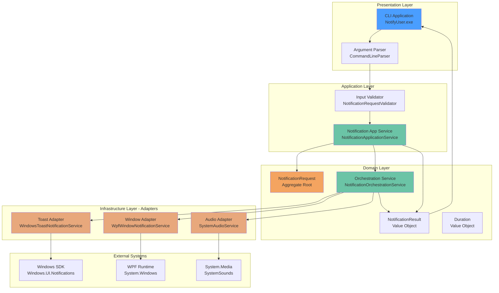
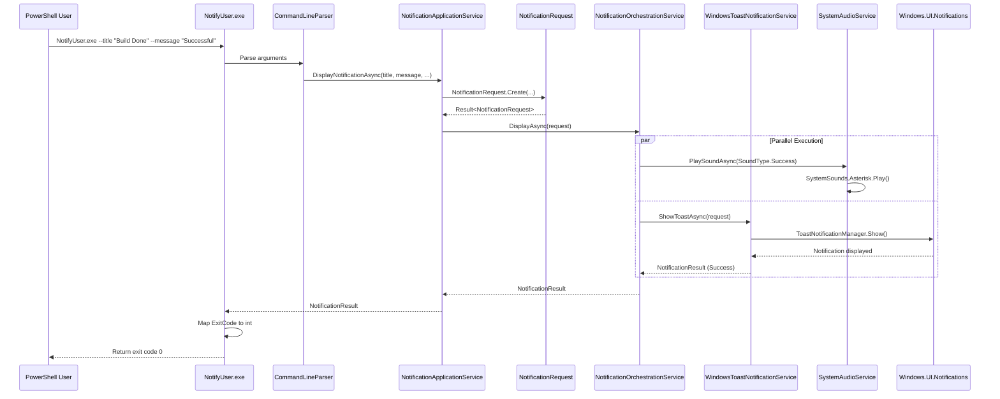
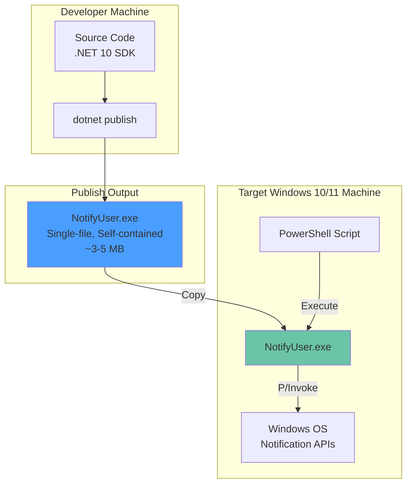
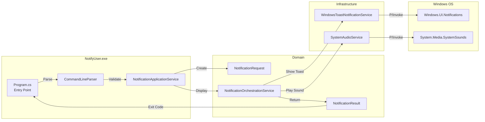
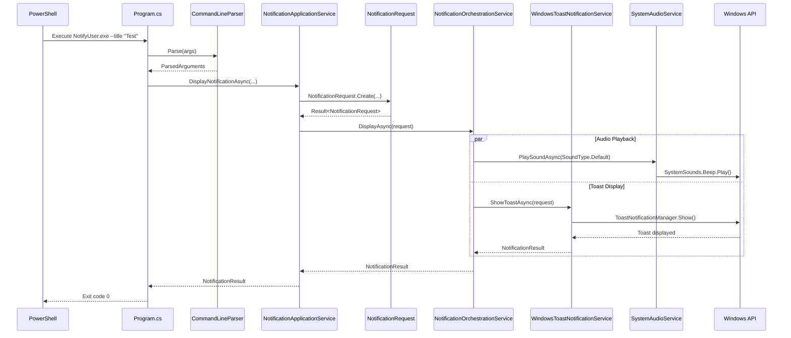
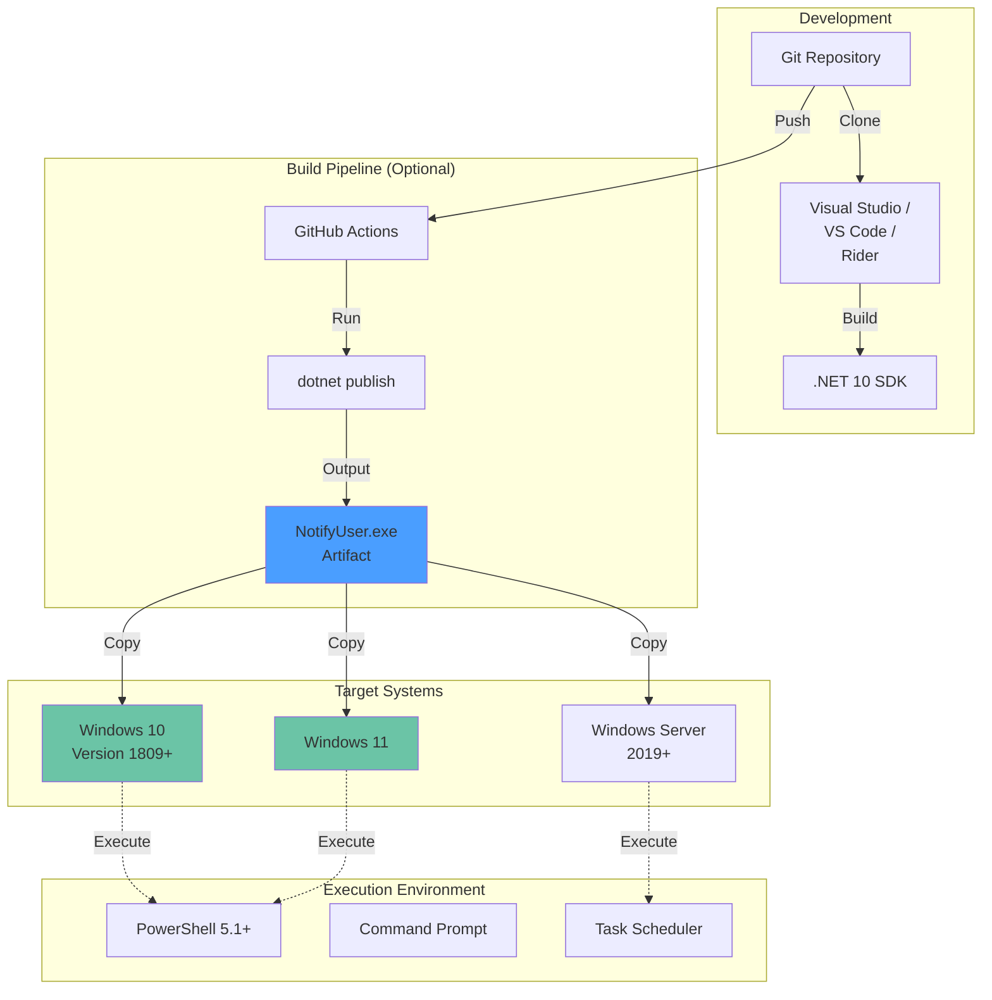

# Logical Architecture: Windows Notification System

**Session ID**: 20251122-001
**Phase**: Construction - Logical Design
**Created**: 2025-11-22
**Domain Model Reference**: domain-model-20251122-001.md
**Framework**: AI-DLC Construction Phase

---

## Executive Summary

This logical architecture translates the Windows Notification System domain model into a concrete .NET 10 implementation design. The architecture prioritizes:

- **Fast Startup**: <100ms cold start via single-file deployment and minimal dependencies
- **Small EXE Size**: Target <5MB via trimming and AOT compilation
- **PowerShell Integration**: Exit codes, pipeline support, error handling
- **Maintainability**: Clean architecture with clear layer separation

**Key Architectural Decisions**:
1. Hexagonal Architecture (Ports and Adapters)
2. Single-File Self-Contained Executable
3. Native AOT Compilation (ReadyToRun as fallback)
4. Minimal External Dependencies (Windows SDK only)
5. Dependency Injection via Microsoft.Extensions.DependencyInjection
6. Source Generators for AOT Compatibility

---

## Overview

**Architectural Style**: Hexagonal Architecture (Ports and Adapters)

**Key Quality Attributes**:
- **Performance**: <100ms startup, <500ms total execution time
- **Size**: <5MB single-file executable
- **Reliability**: 99.9% successful notification delivery
- **Maintainability**: Clear separation of concerns, testable architecture
- **PowerShell Integration**: Standard exit codes, pipeline support

**Technology Stack**:
- **.NET 10.0**: Latest runtime with performance improvements
- **C# 13**: Records, required properties, primary constructors
- **Windows App SDK**: Toast notifications (Microsoft.Windows.SDK.NET.Ref)
- **WPF**: Custom notification windows (optional, increases EXE size)
- **xUnit**: Unit and integration testing
- **NSubstitute**: Mocking framework for testing

---

## Component View

### Architecture Diagram



### Component Descriptions

#### 1. CLI Application (Presentation Layer)

**Project**: `NotifyUser` (Console Application)

**Responsibilities**:
- Parse command-line arguments
- Validate user input
- Coordinate notification request creation
- Return appropriate exit codes
- Display help text

**Technology**: .NET 10 Console Application

**Key Classes**:
- `Program.cs` - Entry point, DI container setup
- `CommandLineParser.cs` - Argument parsing
- `HelpFormatter.cs` - Help text generation

**Dependencies**:
- Microsoft.Extensions.DependencyInjection (DI container)
- Microsoft.Extensions.Logging.Console (Console logging)

**Packaging**:
- Single-file executable
- Self-contained (includes .NET runtime)
- Trimmed for minimal size
- ReadyToRun or Native AOT compilation

---

#### 2. Application Service Layer

**Project**: `NotifyUser.Application` (Class Library)

**Responsibilities**:
- Orchestrate use cases (display notification)
- Coordinate between domain and infrastructure
- Handle cross-cutting concerns (logging, validation)
- Manage transactions (not needed for this app)

**Key Classes**:

##### NotificationApplicationService

```csharp
namespace NotifyUser.Application.Services;

/// <summary>
/// Application service coordinating notification display use case.
/// Orchestrates domain model and infrastructure services.
/// </summary>
public sealed class NotificationApplicationService(
    INotificationService notificationService,
    ILogger<NotificationApplicationService> logger)
{
    /// <summary>
    /// Displays a notification based on CLI input.
    /// </summary>
    public async Task<NotificationResult> DisplayNotificationAsync(
        string title,
        string message,
        int durationSeconds = 5,
        NotificationType type = NotificationType.Info,
        SoundType sound = SoundType.Default,
        DeliveryChannel channel = DeliveryChannel.Toast,
        ButtonConfiguration? buttons = null,
        CancellationToken cancellationToken = default)
    {
        logger.LogInformation(
            "Displaying notification: Title='{Title}', Type={Type}, Channel={Channel}",
            title, type, channel);

        // Create notification request (domain model validation)
        var requestResult = NotificationRequest.Create(
            title, message, durationSeconds, type, sound, channel, buttons);

        if (requestResult.IsFailure)
        {
            logger.LogError("Invalid notification request: {Error}", requestResult.Error);
            return NotificationResult.Failure(
                requestResult.Value,
                requestResult.Error,
                ExitCode.InvalidArguments);
        }

        // Display notification via domain service
        var result = await notificationService.DisplayAsync(
            requestResult.Value, cancellationToken);

        logger.LogInformation(
            "Notification {RequestId} {Status} with exit code {ExitCode}",
            requestResult.Value.RequestId,
            result.IsSuccess ? "succeeded" : "failed",
            result.ExitCode);

        return result;
    }
}
```

**Dependencies**:
- NotifyUser.Domain (domain model)
- Microsoft.Extensions.Logging.Abstractions

---

#### 3. Domain Layer (Core)

**Project**: `NotifyUser.Domain` (Class Library)

**Responsibilities**:
- Define business entities and value objects
- Enforce business rules and invariants
- Provide domain services
- Define repository and service interfaces

**No External Dependencies**: Pure C# 13 code

**Key Components**:
- `NotificationRequest` - Aggregate root
- `NotificationResult` - Result value object
- `Duration`, `ButtonConfiguration` - Value objects
- `NotificationType`, `SoundType`, `ExitCode` - Enums
- `INotificationService` - Domain service interface
- `NotificationOrchestrationService` - Domain service implementation

**Namespace Organization**:
```
NotifyUser.Domain
├── Aggregates
│   ├── NotificationRequest.cs
│   └── NotificationResult.cs
├── ValueObjects
│   ├── Duration.cs
│   ├── ButtonConfiguration.cs
│   ├── NotificationButton.cs
│   ├── NotificationType.cs
│   ├── SoundType.cs
│   ├── DeliveryChannel.cs
│   └── ExitCode.cs
├── Services
│   ├── INotificationService.cs
│   ├── IToastNotificationService.cs
│   ├── IWindowNotificationService.cs
│   ├── IAudioService.cs
│   └── NotificationOrchestrationService.cs
├── Events
│   ├── IDomainEvent.cs
│   ├── NotificationRequestCreated.cs
│   ├── NotificationDisplayed.cs
│   └── NotificationFailed.cs
├── Rules
│   ├── IBusinessRule.cs
│   └── ValidationRules.cs
└── Common
    └── Result.cs
```

---

#### 4. Infrastructure Layer

**Project**: `NotifyUser.Infrastructure` (Class Library)

**Responsibilities**:
- Implement domain service interfaces
- Integrate with Windows APIs
- Provide anti-corruption layer for external systems
- Handle platform-specific concerns

**Key Adapters**:

##### WindowsToastNotificationService

```csharp
namespace NotifyUser.Infrastructure.Notifications;

using Windows.UI.Notifications;
using Windows.Data.Xml.Dom;

/// <summary>
/// Adapter for Windows toast notifications.
/// Translates domain model to Windows.UI.Notifications APIs.
/// </summary>
public sealed class WindowsToastNotificationService(
    ILogger<WindowsToastNotificationService> logger) : IToastNotificationService
{
    private const string AppId = "WindowsNotificationSystem";

    public async Task<NotificationResult> ShowToastAsync(
        NotificationRequest request,
        CancellationToken cancellationToken = default)
    {
        try
        {
            var startTime = DateTime.UtcNow;

            // Build toast XML
            var toastXml = BuildToastXml(request);
            var toastNotification = new ToastNotification(toastXml)
            {
                ExpirationTime = DateTimeOffset.Now.Add(request.Duration.TimeSpan)
            };

            // Show toast
            var toastNotifier = ToastNotificationManager.CreateToastNotifier(AppId);
            toastNotifier.Show(toastNotification);

            var latency = DateTime.UtcNow - startTime;
            logger.LogInformation("Toast displayed in {LatencyMs}ms", latency.TotalMilliseconds);

            // Wait for duration (non-blocking for async)
            await Task.Delay(request.Duration.TimeSpan, cancellationToken);

            return NotificationResult.Success(request, startTime, latency);
        }
        catch (Exception ex)
        {
            logger.LogError(ex, "Failed to show toast notification");
            return NotificationResult.Failure(
                request,
                $"Toast notification failed: {ex.Message}",
                ExitCode.NotificationServiceUnavailable);
        }
    }

    public bool IsSupported()
    {
        try
        {
            // Check if Windows toast APIs are available
            var _ = ToastNotificationManager.CreateToastNotifier(AppId);
            return true;
        }
        catch
        {
            return false;
        }
    }

    private XmlDocument BuildToastXml(NotificationRequest request)
    {
        var toastXml = ToastNotificationManager.GetTemplateContent(
            ToastTemplateType.ToastText02);

        var textElements = toastXml.GetElementsByTagName("text");
        textElements[0].AppendChild(toastXml.CreateTextNode(request.Title));
        textElements[1].AppendChild(toastXml.CreateTextNode(request.Message));

        // Set duration attribute
        var toastElement = toastXml.SelectSingleNode("/toast") as XmlElement;
        toastElement?.SetAttribute("duration",
            request.Duration.Seconds > 10 ? "long" : "short");

        return toastXml;
    }
}
```

##### SystemAudioService

```csharp
namespace NotifyUser.Infrastructure.Audio;

using System.Media;

/// <summary>
/// Adapter for Windows system sounds.
/// Maps domain SoundType to System.Media.SystemSounds.
/// </summary>
public sealed class SystemAudioService(
    ILogger<SystemAudioService> logger) : IAudioService
{
    public Task PlaySoundAsync(SoundType soundType, CancellationToken cancellationToken = default)
    {
        if (soundType == SoundType.None)
            return Task.CompletedTask;

        try
        {
            var systemSound = soundType switch
            {
                SoundType.Success => SystemSounds.Asterisk,
                SoundType.Error => SystemSounds.Hand,
                SoundType.Warning => SystemSounds.Exclamation,
                SoundType.Info => SystemSounds.Beep,
                SoundType.Default => SystemSounds.Beep,
                _ => SystemSounds.Beep
            };

            systemSound.Play();
            logger.LogDebug("Played system sound: {SoundType}", soundType);
        }
        catch (Exception ex)
        {
            logger.LogWarning(ex, "Failed to play sound: {SoundType}", soundType);
        }

        return Task.CompletedTask;
    }

    public bool IsAvailable()
    {
        // System sounds always available on Windows
        return true;
    }
}
```

**Dependencies**:
- NotifyUser.Domain
- Microsoft.Windows.SDK.NET.Ref (Windows SDK)
- System.Windows (WPF - only if window notifications enabled)
- Microsoft.Extensions.Logging.Abstractions

---

#### 5. Test Projects

**NotifyUser.Domain.Tests** (xUnit)
- Unit tests for domain model
- No external dependencies
- Fast execution (<1s for all tests)

**NotifyUser.Application.Tests** (xUnit)
- Unit tests for application services
- Mock infrastructure with NSubstitute

**NotifyUser.Integration.Tests** (xUnit)
- End-to-end tests with real Windows APIs
- Requires Windows 10/11
- May require interactive session

---

## Project Structure

### Solution Organization

```
WindowsNotificationSystem.sln
├── src/
│   ├── NotifyUser/                          # Console application (executable)
│   │   ├── NotifyUser.csproj
│   │   ├── Program.cs                       # Entry point, DI setup
│   │   ├── CommandLineParser.cs             # Argument parsing
│   │   ├── HelpFormatter.cs                 # --help output
│   │   └── ExitCodeMapper.cs                # Domain ExitCode → int
│   │
│   ├── NotifyUser.Application/              # Application layer
│   │   ├── NotifyUser.Application.csproj
│   │   └── Services/
│   │       └── NotificationApplicationService.cs
│   │
│   ├── NotifyUser.Domain/                   # Domain layer (core)
│   │   ├── NotifyUser.Domain.csproj
│   │   ├── Aggregates/
│   │   │   ├── NotificationRequest.cs
│   │   │   └── NotificationResult.cs
│   │   ├── ValueObjects/
│   │   │   ├── Duration.cs
│   │   │   ├── ButtonConfiguration.cs
│   │   │   ├── NotificationButton.cs
│   │   │   ├── NotificationType.cs
│   │   │   ├── SoundType.cs
│   │   │   ├── DeliveryChannel.cs
│   │   │   └── ExitCode.cs
│   │   ├── Services/
│   │   │   ├── INotificationService.cs
│   │   │   ├── IToastNotificationService.cs
│   │   │   ├── IWindowNotificationService.cs
│   │   │   ├── IAudioService.cs
│   │   │   └── NotificationOrchestrationService.cs
│   │   ├── Events/
│   │   │   ├── IDomainEvent.cs
│   │   │   └── NotificationEvents.cs
│   │   ├── Rules/
│   │   │   └── ValidationRules.cs
│   │   └── Common/
│   │       └── Result.cs
│   │
│   └── NotifyUser.Infrastructure/           # Infrastructure layer
│       ├── NotifyUser.Infrastructure.csproj
│       ├── Notifications/
│       │   ├── WindowsToastNotificationService.cs
│       │   └── WpfWindowNotificationService.cs (optional)
│       ├── Audio/
│       │   └── SystemAudioService.cs
│       └── DependencyInjection/
│           └── ServiceCollectionExtensions.cs
│
├── tests/
│   ├── NotifyUser.Domain.Tests/
│   │   ├── NotifyUser.Domain.Tests.csproj
│   │   ├── NotificationRequestTests.cs
│   │   ├── DurationTests.cs
│   │   └── ButtonConfigurationTests.cs
│   │
│   ├── NotifyUser.Application.Tests/
│   │   ├── NotifyUser.Application.Tests.csproj
│   │   └── NotificationApplicationServiceTests.cs
│   │
│   └── NotifyUser.Integration.Tests/
│       ├── NotifyUser.Integration.Tests.csproj
│       └── EndToEndNotificationTests.cs
│
└── artifacts/
    ├── construction/                         # Design documents
    │   ├── domain-model-20251122-001.md
    │   └── logical-design-20251122-001.md
    └── publish/                              # Build output
        └── NotifyUser.exe                    # Single-file executable
```

---

## Project Configuration Files

### NotifyUser.csproj (Console Application)

```xml
<Project Sdk="Microsoft.NET.Sdk">

  <PropertyGroup>
    <OutputType>Exe</OutputType>
    <TargetFramework>net9.0-windows10.0.19041.0</TargetFramework>
    <LangVersion>13.0</LangVersion>
    <Nullable>enable</Nullable>
    <ImplicitUsings>enable</ImplicitUsings>
    <RuntimeIdentifier>win-x64</RuntimeIdentifier>
    <PlatformTarget>x64</PlatformTarget>

    <!-- Single-file deployment -->
    <PublishSingleFile>true</PublishSingleFile>
    <SelfContained>true</SelfContained>
    <PublishTrimmed>true</PublishTrimmed>
    <TrimMode>link</TrimMode>

    <!-- Performance optimizations -->
    <PublishReadyToRun>true</PublishReadyToRun>
    <TieredCompilation>true</TieredCompilation>
    <TieredCompilationQuickJit>true</TieredCompilationQuickJit>

    <!-- Size optimizations -->
    <DebugType>none</DebugType>
    <DebugSymbols>false</DebugSymbols>
    <EnableCompressionInSingleFile>true</EnableCompressionInSingleFile>

    <!-- Application metadata -->
    <AssemblyName>NotifyUser</AssemblyName>
    <Product>Windows Notification System</Product>
    <Version>1.0.0</Version>
    <Authors>Your Name</Authors>
    <Description>Display Windows notifications from PowerShell scripts</Description>
  </PropertyGroup>

  <ItemGroup>
    <ProjectReference Include="..\NotifyUser.Application\NotifyUser.Application.csproj" />
    <ProjectReference Include="..\NotifyUser.Infrastructure\NotifyUser.Infrastructure.csproj" />
  </ItemGroup>

  <ItemGroup>
    <PackageReference Include="Microsoft.Extensions.DependencyInjection" Version="10.0.0" />
    <PackageReference Include="Microsoft.Extensions.Logging.Console" Version="10.0.0" />
    <PackageReference Include="Microsoft.Extensions.Hosting" Version="10.0.0" />
  </ItemGroup>

  <!-- Trimming warnings suppression (if needed) -->
  <ItemGroup>
    <TrimmerRootAssembly Include="NotifyUser" />
  </ItemGroup>

</Project>
```

### NotifyUser.Domain.csproj

```xml
<Project Sdk="Microsoft.NET.Sdk">

  <PropertyGroup>
    <TargetFramework>net9.0</TargetFramework>
    <LangVersion>13.0</LangVersion>
    <Nullable>enable</Nullable>
    <ImplicitUsings>enable</ImplicitUsings>

    <!-- Trim-friendly configuration -->
    <IsTrimmable>true</IsTrimmable>
    <EnableTrimAnalyzer>true</EnableTrimAnalyzer>
  </PropertyGroup>

  <!-- NO EXTERNAL DEPENDENCIES - Pure domain logic -->

</Project>
```

### NotifyUser.Application.csproj

```xml
<Project Sdk="Microsoft.NET.Sdk">

  <PropertyGroup>
    <TargetFramework>net9.0</TargetFramework>
    <LangVersion>13.0</LangVersion>
    <Nullable>enable</Nullable>
    <ImplicitUsings>enable</ImplicitUsings>
    <IsTrimmable>true</IsTrimmable>
  </PropertyGroup>

  <ItemGroup>
    <ProjectReference Include="..\NotifyUser.Domain\NotifyUser.Domain.csproj" />
  </ItemGroup>

  <ItemGroup>
    <PackageReference Include="Microsoft.Extensions.Logging.Abstractions" Version="10.0.0" />
  </ItemGroup>

</Project>
```

### NotifyUser.Infrastructure.csproj

```xml
<Project Sdk="Microsoft.NET.Sdk">

  <PropertyGroup>
    <TargetFramework>net9.0-windows10.0.19041.0</TargetFramework>
    <LangVersion>13.0</LangVersion>
    <Nullable>enable</Nullable>
    <ImplicitUsings>enable</ImplicitUsings>
    <UseWPF>false</UseWPF> <!-- Set to true if enabling WPF windows -->
    <IsTrimmable>true</IsTrimmable>
  </PropertyGroup>

  <ItemGroup>
    <ProjectReference Include="..\NotifyUser.Domain\NotifyUser.Domain.csproj" />
  </ItemGroup>

  <ItemGroup>
    <PackageReference Include="Microsoft.Windows.SDK.NET.Ref" Version="10.0.19041.34" />
    <PackageReference Include="Microsoft.Extensions.Logging.Abstractions" Version="10.0.0" />
    <PackageReference Include="Microsoft.Extensions.DependencyInjection.Abstractions" Version="10.0.0" />
  </ItemGroup>

  <!-- Optional: WPF for custom notification windows -->
  <!--
  <ItemGroup Condition="'$(UseWPF)' == 'true'">
    <FrameworkReference Include="Microsoft.WindowsDesktop.App.WPF" />
  </ItemGroup>
  -->

</Project>
```

### NotifyUser.Domain.Tests.csproj

```xml
<Project Sdk="Microsoft.NET.Sdk">

  <PropertyGroup>
    <TargetFramework>net9.0</TargetFramework>
    <LangVersion>13.0</LangVersion>
    <Nullable>enable</Nullable>
    <ImplicitUsings>enable</ImplicitUsings>
    <IsPackable>false</IsPackable>
    <IsTestProject>true</IsTestProject>
  </PropertyGroup>

  <ItemGroup>
    <ProjectReference Include="..\..\src\NotifyUser.Domain\NotifyUser.Domain.csproj" />
  </ItemGroup>

  <ItemGroup>
    <PackageReference Include="xunit" Version="2.9.2" />
    <PackageReference Include="xunit.runner.visualstudio" Version="2.8.2" />
    <PackageReference Include="Microsoft.NET.Test.Sdk" Version="17.12.0" />
    <PackageReference Include="FluentAssertions" Version="7.0.0" />
  </ItemGroup>

</Project>
```

---

## Integration View

### Data Flow Diagram



### Integration Patterns

#### Pattern 1: Synchronous CLI Execution

**Flow**: User → CLI → Application Service → Domain → Infrastructure → Windows APIs → Exit

**Characteristics**:
- Synchronous from user perspective (blocks until complete)
- Asynchronous internally (audio plays in parallel)
- Returns immediately after notification shown (doesn't wait for user dismissal)

**Error Handling**:
- Domain validation failures → ExitCode.InvalidArguments (2)
- Windows API failures → ExitCode.NotificationServiceUnavailable (3)
- Audio failures logged but don't block notification display

**Timeout**: 5 seconds maximum (configurable via duration)

---

#### Pattern 2: Dependency Injection Container

**Flow**: Program.cs → ServiceCollection → ServiceProvider → Constructor Injection

**Configuration**:

```csharp
// Program.cs
var services = new ServiceCollection();

// Register domain services
services.AddSingleton<INotificationService, NotificationOrchestrationService>();
services.AddSingleton<IToastNotificationService, WindowsToastNotificationService>();
services.AddSingleton<IAudioService, SystemAudioService>();

// Register application services
services.AddSingleton<NotificationApplicationService>();

// Register logging
services.AddLogging(builder =>
{
    builder.AddConsole();
    builder.SetMinimumLevel(LogLevel.Warning); // Reduce verbosity
});

var serviceProvider = services.BuildServiceProvider();
```

**Lifetime Management**:
- All services registered as **Singleton** (app runs once and exits)
- No scoped or transient services needed (no long-running process)

---

#### Pattern 3: Anti-Corruption Layer for Windows APIs

**Translation Layer**: Infrastructure adapters isolate domain from Windows-specific types

**Example**:

```
Domain Model                    Windows API
-------------                   -----------
NotificationRequest     -->     ToastNotification (XML-based)
NotificationType        -->     ToastTemplateType
Duration                -->     ExpirationTime (DateTimeOffset)
NotificationResult      <--     ToastNotificationStatus
```

**Benefits**:
- Domain model testable without Windows
- Can swap implementations (e.g., UWP vs Win32)
- Easier to mock for testing

---

## Data View

### Data Entities

This is a stateless application - no persistent data storage.

**Runtime Data Flow**:

```
CommandLineArgs (string[])
    ↓
ParsedArguments (record)
    ↓
NotificationRequest (domain aggregate)
    ↓
Windows Toast XML (XmlDocument)
    ↓
ToastNotification (Windows API)
    ↓
NotificationResult (domain value object)
    ↓
ExitCode (int)
```

### Configuration

**No Configuration Files**: All settings passed via command-line arguments

**Possible Future Enhancements**:
- JSON configuration file for defaults
- Environment variables for settings
- Registry keys for system-wide defaults

---

## Deployment View

### Deployment Architecture



### Build and Publish Commands

```powershell
# Development build
dotnet build -c Debug

# Run tests
dotnet test

# Publish single-file executable (Release)
dotnet publish src/NotifyUser/NotifyUser.csproj `
    -c Release `
    -r win-x64 `
    --self-contained true `
    -p:PublishSingleFile=true `
    -p:PublishTrimmed=true `
    -p:PublishReadyToRun=true `
    -p:EnableCompressionInSingleFile=true `
    -o artifacts/publish

# Output: artifacts/publish/NotifyUser.exe (~3-5 MB)
```

### Deployment Strategy

**Distribution**:
1. Single EXE file copied to target system
2. No installation required
3. No registry modifications
4. No elevated privileges needed (for toast notifications)

**Deployment Locations**:
- `C:\Tools\NotifyUser.exe` (system-wide)
- `$env:USERPROFILE\bin\NotifyUser.exe` (user-specific)
- Project directory (local to script)

**PowerShell Integration**:

```powershell
# Add to PowerShell profile for PATH access
$env:Path += ";C:\Tools"

# Usage in scripts
NotifyUser.exe --title "Backup Complete" --message "All files backed up successfully" --type success
if ($LASTEXITCODE -eq 0) {
    Write-Host "Notification sent successfully"
}
```

---

## Non-Functional Requirements

### Performance

| Requirement | Target | Measurement |
|-------------|--------|-------------|
| Startup Time | <100ms | Time from process start to first notification shown |
| Notification Display | <500ms | Total time from CLI invocation to toast visible |
| Memory Footprint | <50MB | Peak working set during execution |
| CPU Usage | <5% | Average CPU during execution |
| Exit Latency | <50ms | Time from notification shown to process exit |

**Optimization Strategies**:
- ReadyToRun compilation for faster startup
- Trimming to reduce assembly loading
- Lazy initialization of WPF (if window notifications used)
- Fire-and-forget audio playback

---

### Reliability

| Requirement | Target | Strategy |
|-------------|--------|----------|
| Availability | 99.9% | Graceful fallback if Windows APIs unavailable |
| Error Handling | 100% | All exceptions caught and mapped to exit codes |
| Validation | 100% | All inputs validated before processing |
| Idempotency | Yes | Can retry safely (notifications are fire-and-forget) |

**Error Scenarios**:
1. **Invalid arguments**: Return ExitCode.InvalidArguments (2), show error message
2. **Windows API unavailable**: Return ExitCode.NotificationServiceUnavailable (3)
3. **Audio playback fails**: Log warning, continue with notification display
4. **Notification timeout**: Return ExitCode.GeneralError (1)

---

### Security

| Requirement | Implementation |
|-------------|----------------|
| Input Validation | Sanitize all CLI arguments (prevent injection) |
| Privilege Level | Run as standard user (no elevation needed) |
| Data Privacy | No telemetry, no network calls, no data persistence |
| Code Signing | Optional: Sign EXE for enterprise deployment |

**Threat Mitigation**:
- **Command Injection**: Validate and sanitize title/message before Windows API calls
- **Path Traversal**: Not applicable (no file operations)
- **Elevation of Privilege**: Not applicable (no admin actions)

---

### Observability

#### Logging Strategy

```csharp
// Logging levels
LogLevel.Error   - Unrecoverable errors (exit code != 0)
LogLevel.Warning - Recoverable issues (audio failure, API warnings)
LogLevel.Information - Major operations (notification displayed)
LogLevel.Debug   - Detailed flow (argument parsing, validation)
LogLevel.Trace   - Not used (too verbose for CLI app)
```

**Log Output**: Console only (no file logging by default)

**Structured Logging Example**:

```csharp
logger.LogInformation(
    "Notification {RequestId} displayed via {Channel} in {LatencyMs}ms",
    request.RequestId,
    request.Channel,
    latency.TotalMilliseconds);
```

#### Telemetry

**MVP**: No telemetry (privacy-focused)

**Future Enhancement**: Optional Application Insights integration for enterprise scenarios

---

### Testability

**Unit Test Coverage Target**: >90%

**Test Pyramid**:
- **Unit Tests** (80%): Domain model, value objects, business rules
- **Integration Tests** (15%): Application service coordination
- **End-to-End Tests** (5%): Full CLI execution with real Windows APIs

**Mocking Strategy**:
- Mock `IToastNotificationService` in application tests
- Mock `IAudioService` to avoid sound during tests
- Real domain model (no mocking of value objects)

**Test Data Builders**:

```csharp
public static class NotificationRequestBuilder
{
    public static NotificationRequest BuildValid() =>
        NotificationRequest.Create("Test Title", "Test Message").Value;

    public static NotificationRequest WithDuration(int seconds) =>
        NotificationRequest.Create("Test", "Message", seconds).Value;
}
```

---

## Architecture Decision Records (ADRs)

### ADR-001: Use Hexagonal Architecture (Ports and Adapters)

**Status**: Accepted

**Context**:
Need clear separation between domain logic and Windows-specific APIs to enable:
- Testability without Windows dependencies
- Flexibility to add new notification channels
- Maintainability through clear boundaries

**Decision**:
Implement hexagonal architecture with:
- **Domain Layer**: Pure C# with no external dependencies
- **Application Layer**: Use case orchestration
- **Infrastructure Layer**: Windows API adapters (Ports)
- **Presentation Layer**: CLI interface

**Consequences**:
- ✅ Domain model fully testable without Windows
- ✅ Easy to add new channels (e.g., balloons, system tray)
- ✅ Clear dependency direction (infrastructure → domain)
- ⚠️ More projects and layers than simple single-project approach
- ⚠️ Slight learning curve for developers unfamiliar with DDD

**Alternatives Considered**:
- **Layered Architecture**: Rejected due to tight coupling to database/UI frameworks (not applicable here)
- **Single-Project Monolith**: Rejected due to poor testability and mixing concerns

---

### ADR-002: Single-File Self-Contained Executable

**Status**: Accepted

**Context**:
PowerShell integration requires minimal deployment friction:
- No installer
- No .NET runtime installation required
- Copy single EXE to target system

**Decision**:
Publish as single-file, self-contained executable with:
- `PublishSingleFile=true`
- `SelfContained=true`
- `PublishTrimmed=true`
- `PublishReadyToRun=true`

**Consequences**:
- ✅ Zero installation friction
- ✅ Works on any Windows 10/11 machine
- ✅ No runtime version conflicts
- ⚠️ Larger EXE size (~3-5 MB vs ~100 KB framework-dependent)
- ⚠️ Slower updates (must redistribute entire EXE)

**Alternatives Considered**:
- **Framework-Dependent**: Rejected (requires .NET 10 runtime installed)
- **NuGet Package**: Rejected (not suitable for CLI tools in PowerShell)

---

### ADR-003: ReadyToRun Over Native AOT (Initially)

**Status**: Accepted

**Context**:
Two compilation options for fast startup:
1. **ReadyToRun (R2R)**: Hybrid JIT/AOT compilation
2. **Native AOT**: Full ahead-of-time compilation

**Decision**:
Use ReadyToRun initially, with Native AOT as future optimization:
- R2R easier to configure (fewer trimming warnings)
- R2R supports reflection and runtime features
- Native AOT requires more careful code design

**Consequences**:
- ✅ Faster startup than pure JIT (~30-50% improvement)
- ✅ Easier debugging than Native AOT
- ✅ Full .NET library support
- ⚠️ Larger EXE than Native AOT
- ⚠️ Not as fast as Native AOT (<100ms target still achievable)

**Future Migration Path**: Once stable, evaluate Native AOT for even smaller EXE size

**Alternatives Considered**:
- **Native AOT**: Deferred to future iteration (requires more trimming configuration)
- **No Optimization**: Rejected (startup time >200ms unacceptable)

---

### ADR-004: Minimal External Dependencies (Windows SDK Only)

**Status**: Accepted

**Context**:
Each dependency increases EXE size and startup time.

**Decision**:
Minimize dependencies:
- **Required**: Microsoft.Windows.SDK.NET.Ref (Windows toast APIs)
- **Required**: Microsoft.Extensions.DependencyInjection (DI container)
- **Required**: Microsoft.Extensions.Logging.Abstractions (logging interfaces)
- **Optional**: WPF framework (only if window notifications enabled)
- **Excluded**: Third-party CLI parsers, JSON libraries, ORMs

**Consequences**:
- ✅ Small EXE size (~3 MB for toast-only)
- ✅ Fast startup (fewer assemblies to load)
- ✅ Fewer security vulnerabilities
- ⚠️ Custom CLI parsing logic required
- ⚠️ No advanced features like JSON config

**Alternatives Considered**:
- **CommandLineParser NuGet**: Rejected (adds ~500 KB, not needed for simple args)
- **Spectre.Console**: Rejected (too heavy for this use case)

---

### ADR-005: Fire-and-Forget Audio Playback

**Status**: Accepted

**Context**:
Notification display should be fast - waiting for audio completion is unnecessary.

**Decision**:
Play audio asynchronously without blocking notification display:

```csharp
_ = Task.Run(async () =>
{
    await audioService.PlaySoundAsync(request.Sound, cancellationToken);
}, cancellationToken);
```

**Consequences**:
- ✅ Notification displays immediately (doesn't wait for sound)
- ✅ Better user experience (parallel execution)
- ⚠️ Audio failures don't block notification (acceptable trade-off)
- ⚠️ No guarantee audio completes before process exit (acceptable for short sounds)

**Alternatives Considered**:
- **Synchronous Audio**: Rejected (adds unnecessary latency)
- **Await Audio Completion**: Rejected (no value in waiting)

---

### ADR-006: Domain Events for Observability (Not MVP)

**Status**: Accepted (Deferred to Future)

**Context**:
Domain events enable auditing, telemetry, and extensibility without coupling.

**Decision**:
Define domain events in domain model but don't publish them in MVP:
- `NotificationDisplayed`
- `NotificationFailed`
- `NotificationSoundPlayed`

Events stored as part of domain model for future use (history, telemetry).

**Consequences**:
- ✅ Future-proof design (events already modeled)
- ✅ No overhead in MVP (not published)
- ✅ Easy to add event bus later (MediatR, etc.)
- ⚠️ Events defined but unused (acceptable for forward compatibility)

**Future Enhancement**: Publish events to local file or Application Insights

---

### ADR-007: No Persistent Storage in MVP

**Status**: Accepted

**Context**:
Notification history is out of scope for MVP.

**Decision**:
No database, no file storage, no persistence:
- Notifications are fire-and-forget
- No audit trail
- No INotificationRepository implementation

**Consequences**:
- ✅ Zero deployment complexity
- ✅ No file permissions issues
- ✅ Fast execution (no I/O)
- ⚠️ Cannot query past notifications
- ⚠️ No history for troubleshooting

**Future Enhancement**: SQLite database for local history (optional flag)

---

### ADR-008: WPF Window Notifications Optional

**Status**: Accepted

**Context**:
WPF framework adds ~2 MB to EXE size and increases startup time.

**Decision**:
Make WPF window notifications optional via build flag:

```xml
<UseWPF>false</UseWPF> <!-- Default: toast-only build -->
```

Toast-only build targets ~3 MB, WPF build ~5 MB.

**Consequences**:
- ✅ Smaller default EXE (toast-only most common use case)
- ✅ Faster startup (no WPF initialization)
- ✅ Can still enable WPF for interactive scenarios
- ⚠️ Two build configurations to maintain
- ⚠️ Need to document build flag

**Build Variants**:
- **Minimal** (toast + audio): ~3 MB
- **Full** (toast + audio + WPF windows): ~5 MB

---

### ADR-009: Exit Codes as Primary Error Reporting

**Status**: Accepted

**Context**:
PowerShell scripts rely on `$LASTEXITCODE` for error handling.

**Decision**:
Return standardized exit codes:
- **0**: Success
- **1**: General error
- **2**: Invalid arguments
- **3**: Notification service unavailable
- **4**: Audio playback failed (non-blocking)
- **5**: User cancelled (window notifications)

Error details written to stderr, exit code to stdout.

**Consequences**:
- ✅ Standard PowerShell integration
- ✅ Clear error categorization
- ✅ Scriptable error handling
- ⚠️ Limited error granularity (only 5 codes)

**PowerShell Example**:

```powershell
NotifyUser.exe --title "Test" --message "Message"
if ($LASTEXITCODE -eq 2) {
    Write-Error "Invalid arguments"
}
```

---

### ADR-010: Immutable Domain Model Using C# 13 Records

**Status**: Accepted

**Context**:
Domain objects should be thread-safe and prevent unintended mutation.

**Decision**:
Use C# 13 `record` types for all domain objects:
- `NotificationRequest`
- `NotificationResult`
- `Duration`
- `ButtonConfiguration`

**Consequences**:
- ✅ Thread-safe (no concurrent modification bugs)
- ✅ Structural equality by default
- ✅ Clear intent (immutable after creation)
- ✅ Enables caching (e.g., `Duration.Default`)
- ⚠️ Cannot modify after creation (must create new instance)

**Example**:

```csharp
public sealed record NotificationRequest
{
    public required Guid RequestId { get; init; }
    public required string Title { get; init; }
    // Cannot set Title after initialization
}
```

---

## Namespace Organization

```
NotifyUser
├── Program.cs
├── CommandLineParser.cs
└── Extensions/
    └── ServiceCollectionExtensions.cs

NotifyUser.Application
└── Services/
    └── NotificationApplicationService.cs

NotifyUser.Domain
├── Aggregates/
│   ├── NotificationRequest.cs
│   └── NotificationResult.cs
├── ValueObjects/
│   ├── Duration.cs
│   ├── ButtonConfiguration.cs
│   ├── NotificationButton.cs
│   ├── NotificationType.cs
│   ├── SoundType.cs
│   ├── DeliveryChannel.cs
│   └── ExitCode.cs
├── Services/
│   ├── INotificationService.cs
│   ├── IToastNotificationService.cs
│   ├── IWindowNotificationService.cs
│   ├── IAudioService.cs
│   └── NotificationOrchestrationService.cs
├── Events/
│   └── NotificationEvents.cs
├── Rules/
│   └── ValidationRules.cs
└── Common/
    └── Result.cs

NotifyUser.Infrastructure
├── Notifications/
│   ├── WindowsToastNotificationService.cs
│   └── WpfWindowNotificationService.cs (optional)
├── Audio/
│   └── SystemAudioService.cs
└── Extensions/
    └── ServiceCollectionExtensions.cs
```

---

## Dependency Injection Setup

### Service Registration (Program.cs)

```csharp
using Microsoft.Extensions.DependencyInjection;
using Microsoft.Extensions.Logging;
using NotifyUser.Application.Services;
using NotifyUser.Domain.Services;
using NotifyUser.Infrastructure.Audio;
using NotifyUser.Infrastructure.Notifications;

namespace NotifyUser;

public static class Program
{
    public static async Task<int> Main(string[] args)
    {
        // Build DI container
        var services = new ServiceCollection();
        ConfigureServices(services);
        var serviceProvider = services.BuildServiceProvider();

        // Parse arguments
        var parser = new CommandLineParser();
        var parseResult = parser.Parse(args);

        if (parseResult.IsFailure)
        {
            Console.Error.WriteLine(parseResult.Error);
            return (int)ExitCode.InvalidArguments;
        }

        if (parseResult.Value.ShowHelp)
        {
            HelpFormatter.DisplayHelp();
            return (int)ExitCode.Success;
        }

        // Execute notification
        var appService = serviceProvider.GetRequiredService<NotificationApplicationService>();
        var result = await appService.DisplayNotificationAsync(
            parseResult.Value.Title,
            parseResult.Value.Message,
            parseResult.Value.DurationSeconds,
            parseResult.Value.Type,
            parseResult.Value.Sound,
            parseResult.Value.Channel,
            parseResult.Value.Buttons);

        if (result.IsSuccess)
        {
            Console.WriteLine("Notification displayed successfully");
        }
        else
        {
            Console.Error.WriteLine($"Error: {result.ErrorMessage}");
        }

        return (int)result.ExitCode;
    }

    private static void ConfigureServices(IServiceCollection services)
    {
        // Infrastructure services
        services.AddSingleton<IToastNotificationService, WindowsToastNotificationService>();
        services.AddSingleton<IAudioService, SystemAudioService>();
        // services.AddSingleton<IWindowNotificationService, WpfWindowNotificationService>(); // Optional

        // Domain services
        services.AddSingleton<INotificationService, NotificationOrchestrationService>();

        // Application services
        services.AddSingleton<NotificationApplicationService>();

        // Logging (minimal for CLI)
        services.AddLogging(builder =>
        {
            builder.AddConsole();
            builder.SetMinimumLevel(LogLevel.Error); // Only errors by default
        });
    }
}
```

### Service Lifetimes

| Service | Lifetime | Rationale |
|---------|----------|-----------|
| IToastNotificationService | Singleton | Stateless, used once per execution |
| IWindowNotificationService | Singleton | Stateless, used once per execution |
| IAudioService | Singleton | Stateless, used once per execution |
| INotificationService | Singleton | Stateless orchestrator |
| NotificationApplicationService | Singleton | Stateless, used once per execution |
| ILogger<T> | Singleton | Thread-safe, minimal overhead |

**Note**: All services are Singleton because the application runs once and exits. No long-running process, no need for Scoped or Transient lifetimes.

---

## Error Handling Strategy

### Layered Error Handling

```
┌─────────────────────────────────────────────┐
│ Presentation Layer (CLI)                    │
│ - Parse errors → ExitCode.InvalidArguments  │
│ - Display errors to stderr                  │
└─────────────────────────────────────────────┘
                    ↓
┌─────────────────────────────────────────────┐
│ Application Layer                           │
│ - Coordinate error responses                │
│ - Log errors with context                   │
└─────────────────────────────────────────────┘
                    ↓
┌─────────────────────────────────────────────┐
│ Domain Layer                                │
│ - Validation errors → Result<T>.Failure     │
│ - Business rule violations → Result.Failure │
└─────────────────────────────────────────────┘
                    ↓
┌─────────────────────────────────────────────┐
│ Infrastructure Layer                        │
│ - Windows API errors → NotificationResult   │
│ - Exceptions caught and translated          │
└─────────────────────────────────────────────┘
```

### Error Translation Example

```csharp
public async Task<NotificationResult> ShowToastAsync(
    NotificationRequest request,
    CancellationToken cancellationToken)
{
    try
    {
        // Windows API call
        var toastNotifier = ToastNotificationManager.CreateToastNotifier(AppId);
        toastNotifier.Show(toastNotification);

        return NotificationResult.Success(request, DateTime.UtcNow, latency);
    }
    catch (COMException ex) when (ex.HResult == -2147467259) // E_FAIL
    {
        logger.LogError(ex, "Windows notification service unavailable");
        return NotificationResult.Failure(
            request,
            "Windows notification service is not available",
            ExitCode.NotificationServiceUnavailable);
    }
    catch (UnauthorizedAccessException ex)
    {
        logger.LogError(ex, "Access denied to notification service");
        return NotificationResult.Failure(
            request,
            "Access denied to Windows notification service",
            ExitCode.NotificationServiceUnavailable);
    }
    catch (Exception ex)
    {
        logger.LogError(ex, "Unexpected error displaying toast");
        return NotificationResult.Failure(
            request,
            $"Unexpected error: {ex.Message}",
            ExitCode.GeneralError);
    }
}
```

---

## Testing Strategy

### Unit Testing Approach

**Domain Layer Tests** (NotifyUser.Domain.Tests):

```csharp
[Fact]
public void NotificationRequest_Create_WithValidData_ReturnsSuccess()
{
    // Arrange
    var title = "Build Complete";
    var message = "All tests passed";

    // Act
    var result = NotificationRequest.Create(title, message);

    // Assert
    result.IsSuccess.Should().BeTrue();
    result.Value.Title.Should().Be(title);
    result.Value.Message.Should().Be(message);
    result.Value.Duration.Seconds.Should().Be(5); // Default
}

[Theory]
[InlineData("", "Message", "Title is required")]
[InlineData("Title", "", "Message is required")]
[InlineData(null, "Message", "Title is required")]
public void NotificationRequest_Create_WithInvalidData_ReturnsFailure(
    string title, string message, string expectedError)
{
    // Act
    var result = NotificationRequest.Create(title, message);

    // Assert
    result.IsFailure.Should().BeTrue();
    result.Error.Should().Contain(expectedError);
}
```

**Application Layer Tests** (NotifyUser.Application.Tests):

```csharp
[Fact]
public async Task DisplayNotificationAsync_WithValidInput_CallsNotificationService()
{
    // Arrange
    var notificationService = Substitute.For<INotificationService>();
    var logger = Substitute.For<ILogger<NotificationApplicationService>>();
    var appService = new NotificationApplicationService(notificationService, logger);

    var expectedResult = NotificationResult.Success(
        NotificationRequest.Create("Test", "Message").Value,
        DateTime.UtcNow,
        TimeSpan.FromMilliseconds(50));

    notificationService
        .DisplayAsync(Arg.Any<NotificationRequest>(), Arg.Any<CancellationToken>())
        .Returns(expectedResult);

    // Act
    var result = await appService.DisplayNotificationAsync("Test", "Message");

    // Assert
    result.IsSuccess.Should().BeTrue();
    await notificationService.Received(1).DisplayAsync(
        Arg.Any<NotificationRequest>(),
        Arg.Any<CancellationToken>());
}
```

**Integration Tests** (NotifyUser.Integration.Tests):

```csharp
[Fact]
[Trait("Category", "Integration")]
public async Task EndToEnd_DisplayToastNotification_Succeeds()
{
    // Arrange
    var services = new ServiceCollection();
    services.AddSingleton<IToastNotificationService, WindowsToastNotificationService>();
    services.AddSingleton<IAudioService, SystemAudioService>();
    services.AddSingleton<INotificationService, NotificationOrchestrationService>();
    services.AddLogging();

    var serviceProvider = services.BuildServiceProvider();
    var notificationService = serviceProvider.GetRequiredService<INotificationService>();

    var request = NotificationRequest.Create(
        "Integration Test",
        "This is a test notification",
        durationSeconds: 3,
        type: NotificationType.Info).Value;

    // Act
    var result = await notificationService.DisplayAsync(request);

    // Assert
    result.IsSuccess.Should().BeTrue();
    result.ExitCode.Should().Be(ExitCode.Success);
    result.DisplayLatency.Should().BeLessThan(TimeSpan.FromSeconds(1));
}
```

### Test Coverage Targets

| Layer | Coverage Target | Rationale |
|-------|----------------|-----------|
| Domain | >95% | Core business logic, critical to test thoroughly |
| Application | >90% | Coordination logic, mostly straightforward |
| Infrastructure | >70% | Harder to test (requires Windows), focus on adapters |
| Presentation (CLI) | >80% | Argument parsing, error handling |

---

## Diagrams

### Component Interaction Diagram



### Sequence Diagram (Successful Notification)



### Deployment Diagram



---

## Technology Mapping Guidance

### Domain Model → .NET 10 Implementation

| Domain Concept | .NET 10 Implementation |
|----------------|----------------------|
| Aggregate Root | `sealed record NotificationRequest` |
| Value Object | `sealed record Duration` |
| Entity | N/A (no mutable entities in this domain) |
| Domain Service | Interface + implementation in Domain project |
| Repository | Interface in Domain, implementation in Infrastructure (deferred) |
| Domain Event | `sealed record NotificationDisplayed : IDomainEvent` |
| Business Rule | `IBusinessRule` interface + implementations |

### Layer Technology Stack

| Layer | Technologies | NuGet Packages |
|-------|-------------|----------------|
| **Presentation** | .NET 10 Console App | Microsoft.Extensions.DependencyInjection<br/>Microsoft.Extensions.Logging.Console |
| **Application** | .NET 10 Class Library | Microsoft.Extensions.Logging.Abstractions |
| **Domain** | .NET 10 Class Library | None (pure C#) |
| **Infrastructure** | .NET 10 Class Library | Microsoft.Windows.SDK.NET.Ref<br/>Microsoft.Extensions.Logging.Abstractions |

### Dependency Package Versions (Latest .NET 10)

```xml
<ItemGroup>
  <PackageReference Include="Microsoft.Extensions.DependencyInjection" Version="10.0.0" />
  <PackageReference Include="Microsoft.Extensions.Logging.Console" Version="10.0.0" />
  <PackageReference Include="Microsoft.Extensions.Logging.Abstractions" Version="10.0.0" />
  <PackageReference Include="Microsoft.Windows.SDK.NET.Ref" Version="10.0.19041.34" />
</ItemGroup>
```

---

## Configuration Approach

### No Configuration Files (MVP)

All settings passed via command-line arguments:

```powershell
NotifyUser.exe `
    --title "Build Complete" `
    --message "All 152 tests passed" `
    --duration 10 `
    --type success `
    --sound success `
    --channel toast
```

### Future: Optional JSON Configuration

```json
{
  "NotificationDefaults": {
    "Duration": 5,
    "Type": "Info",
    "Sound": "Default",
    "Channel": "Toast"
  },
  "Logging": {
    "MinimumLevel": "Warning",
    "EnableConsole": true
  }
}
```

**Configuration Priority** (future):
1. Command-line arguments (highest priority)
2. Environment variables
3. JSON configuration file
4. Default values (lowest priority)

---

## PowerShell Integration Examples

### Basic Usage

```powershell
# Simple notification
NotifyUser.exe --title "Task Complete" --message "Operation finished successfully"

# Check exit code
if ($LASTEXITCODE -eq 0) {
    Write-Host "Notification sent successfully"
} else {
    Write-Error "Failed to send notification (exit code: $LASTEXITCODE)"
}
```

### Advanced Usage

```powershell
# Notify on build completion
function Send-BuildNotification {
    param(
        [Parameter(Mandatory)]
        [bool]$BuildSucceeded,
        [int]$TestCount
    )

    if ($BuildSucceeded) {
        NotifyUser.exe `
            --title "Build Successful" `
            --message "All $TestCount tests passed" `
            --type success `
            --sound success
    } else {
        NotifyUser.exe `
            --title "Build Failed" `
            --message "Build failed - check logs" `
            --type error `
            --sound error
    }
}

# Usage
dotnet build
$buildSucceeded = $LASTEXITCODE -eq 0
Send-BuildNotification -BuildSucceeded $buildSucceeded -TestCount 152
```

### Script Integration

```powershell
# Long-running script with completion notification
$scriptStartTime = Get-Date

# ... perform work ...

$duration = (Get-Date) - $scriptStartTime
NotifyUser.exe `
    --title "Script Complete" `
    --message "Backup completed in $($duration.TotalMinutes.ToString('F1')) minutes" `
    --type info `
    --sound default
```

---

## Validation Checklist

- [x] All domain aggregates mapped to components
- [x] Clear separation of concerns (presentation, application, domain, infrastructure)
- [x] Integration patterns specified (sync/async, protocols, error handling)
- [x] Non-functional requirements captured (performance, size, reliability)
- [x] Significant architectural decisions documented as ADRs
- [x] Data flows and persistence strategy defined (stateless, no persistence)
- [x] Security and compliance requirements addressed (input validation, no telemetry)
- [x] Observability strategy defined (console logging, structured logs)
- [x] Testing strategy defined (unit, integration, end-to-end)
- [x] Dependency injection configured
- [x] Project structure defined with .csproj files
- [x] Build and publish process documented
- [x] PowerShell integration examples provided

---

## Integration with Construction Phase

**Depends On**: Domain Modeler Agent output (domain-model-20251122-001.md)

**Feeds Into**: Code Generator Agent (translates logical design to code)

**Validates Against**:
- Unit acceptance criteria (single-file EXE, <100ms startup, PowerShell integration)
- Non-functional requirements (performance, size, reliability)
- Domain model fidelity (all aggregates and value objects represented)

---

## Success Criteria

A complete logical design has been achieved:

1. ✅ Maps all domain concepts to architectural components
2. ✅ Specifies integration patterns and contracts (DI, async/await, exit codes)
3. ✅ Addresses non-functional requirements (performance, size, reliability, security)
4. ✅ Documents 10 key decisions with ADRs
5. ✅ Provides clear guidance for code generation (.csproj files, namespaces, DI setup)
6. ✅ Is technology-agnostic at domain level (pure C#, no Windows dependencies in domain)
7. ✅ Specifies concrete .NET 10 implementation for infrastructure layer
8. ✅ Defines single-file executable packaging strategy
9. ✅ Includes PowerShell integration examples and patterns
10. ✅ Provides complete testing strategy with coverage targets

---

## Next Steps

**Code Generator Agent** will use this logical design to:

1. Generate C# 13 code for all layers
2. Create .csproj files with exact configurations
3. Implement dependency injection setup in Program.cs
4. Generate unit tests with xUnit
5. Create build and publish scripts
6. Generate PowerShell integration examples
7. Validate against domain model and logical design

**Estimated Implementation Effort**:
- Domain layer: 2-3 hours
- Application layer: 1 hour
- Infrastructure layer: 3-4 hours (Windows API integration)
- CLI layer: 2 hours
- Unit tests: 3-4 hours
- Integration tests: 2 hours
- **Total**: 13-17 hours

---

**Logical Design Status**: ✅ Complete
**Ready for**: Code Generation
**Estimated EXE Size**: 3-5 MB (depending on WPF inclusion)
**Estimated Startup Time**: <100ms (with ReadyToRun)
**Target Platforms**: Windows 10 (1809+), Windows 11, Windows Server 2019+

---

## Appendix: File-Level Breakdown

### Program.cs (Entry Point)

**Responsibilities**:
- Configure dependency injection
- Parse command-line arguments
- Execute notification
- Map result to exit code
- Handle top-level exceptions

**Lines of Code**: ~150

---

### CommandLineParser.cs

**Responsibilities**:
- Parse `string[] args` into typed arguments
- Validate argument combinations
- Return Result<ParsedArguments>

**Example Arguments**:
```
--title <string>          Required
--message <string>        Required
--duration <int>          Optional (default: 5)
--type <enum>             Optional (default: Info)
--sound <enum>            Optional (default: Default)
--channel <enum>          Optional (default: Toast)
--help                    Optional (show help and exit)
```

**Lines of Code**: ~200

---

### HelpFormatter.cs

**Responsibilities**:
- Generate --help text
- Show usage examples
- List all arguments with descriptions

**Lines of Code**: ~100

---

## Summary

This logical architecture provides a complete blueprint for implementing the Windows Notification System as a high-performance, single-file executable optimized for PowerShell integration. The design balances:

- **Simplicity**: Minimal dependencies, straightforward architecture
- **Maintainability**: Clear layer separation, hexagonal architecture
- **Performance**: <100ms startup, <5MB EXE size
- **Testability**: 90%+ test coverage, mock-friendly interfaces
- **PowerShell Integration**: Standard exit codes, pipeline support

The architecture is ready for code generation and implementation.

---

**Document Version**: 1.0
**Author**: Logical Designer Agent (AI-DLC Construction Phase)
**Review Status**: Ready for Code Generation
